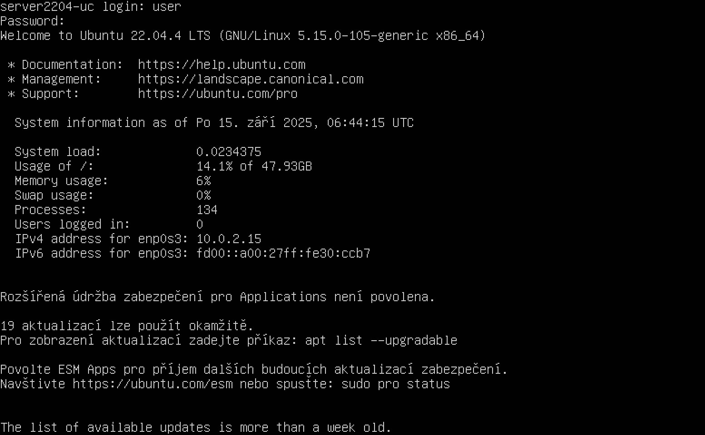

# Ubuntu Server Installation (Server Installation)

Basic installation of Ubuntu Server in VirtualBox as a foundation for a web or mail server.

## Step-by-Step Guide

### 1. VM Configuration
Create a VM in VirtualBox, attach the Ubuntu Server ISO. Recommended RAM: 2 GB, disk: 20 GB. Start the installation.



> [!TIP]
> Download Ubuntu Server LTS (Long Term Support) — it's more stable than regular releases.

### 2. Installation Wizard
Go through the installation wizard — select language, keyboard, installation type. "Minimized" is sufficient for a server.

> [!TIP]
> Minimized installation does not include unnecessary packages — the server will be faster and more secure.

### 3. Identity and SSH
Set the hostname, username and password. On the SSH Services screen check "Install OpenSSH server".

> [!TIP]
> SSH allows convenient connection from the host PC — you will not need to type commands directly into the VM window.

### 4. Updates
After installation log in and update the system.

```bash
sudo apt update
sudo apt upgrade -y
```

## Troubleshooting & FAQ

#### Ubuntu VM has no internet access — apt update fails.
> **Solution:** Check the network adapter in VirtualBox — it must be NAT or Bridged, not Internal Network. Change in Settings → Network → Adapter 1 → NAT.

#### Installation stuck on "Waiting for unattended-upgr to exit".
> **Solution:** Wait — it can take up to 5 minutes. If it takes longer, press Enter or Ctrl+C. The system is installed, background automatic updates are just running.

---
[ Back to Overview](../../README.md)