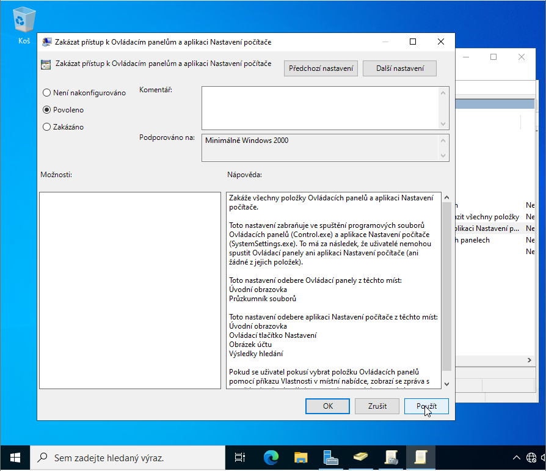
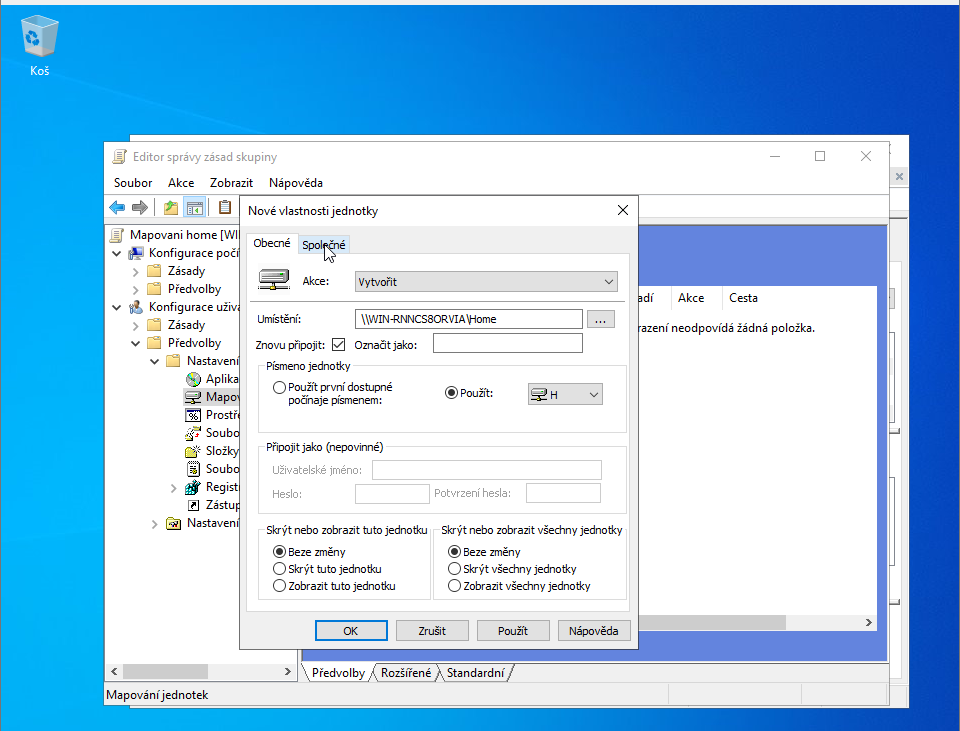

# Group Policy (GPO) (Group Policy - GPO)

Configuring Group Policy to restrict user access — disabling control panels, desktop, and mapping network drives.

## Step-by-Step Guide

### 1. New GPO Object
Open "Group Policy Management" (gpmc.msc). Right-click the domain or OU → "Create a GPO in this domain". Name the policy.

> [!TIP]
> Apply GPO to a specific OU (e.g. Students), not the entire domain — otherwise you will also restrict administrators.

### 2. Policy Editing
Right-click the GPO → Edit. Group Policy Management Editor opens. Navigate to User Configuration → Policies → Administrative Templates.


> [!TIP]
> User Configuration affects users regardless of which PC they log into. Computer Configuration affects the computer.

### 3. Disable Control Panel
User Configuration → Administrative Templates → Control Panel → "Prohibit access to Control Panel and PC settings" → Enabled.



> [!WARNING]
> This setting prevents users from changing system settings — suitable for students and public computers.

### 4. Disable Desktop Background Changes
User Configuration → Administrative Templates → Desktop → "Prohibit User from changing desktop background" → Enabled.


### 5. Additional Restrictions
Add more access restrictions — e.g. blocking certain applications or access to the command prompt.


> [!TIP]
> Each setting has a description of what it does — read the "Help" tab in the GPO editor.

### 6. Network Drive Mapping via GPO
User Configuration → Preferences → Windows Settings → Drive Maps → New → Mapped Drive. Enter the UNC path (\server\folder) and drive letter.



> [!TIP]
> Mapping via GPO Preferences is better than a login script — it works more reliably and is easy to manage.

### 7. Security Filtering Link
Link the GPO to a group — in GPO Management click the "Scope" tab and add the user group to "Security Filtering".


> [!TIP]
> Security Filtering lets you apply the GPO only to selected groups — e.g. only the Students group.

### 8. Policy Update Force
Force a policy update on the client with gpupdate or wait for the automatic update (every 90 minutes).

```powershell
gpupdate /force
gpresult /r
```

> [!TIP]
> gpresult /r shows which GPOs are applied to the current user and computer.

## Troubleshooting & FAQ

#### GPO is not applied to the user — gpresult /r does not show it.
> **Solution:** Check: 1) GPO is linked to the correct OU where the user is. 2) Security Filtering contains the user group or "Authenticated Users". 3) Run gpupdate /force on the client. 4) Log the user out and back in.

#### Network drive mapping does not work — the drive does not appear.
> **Solution:** Check the UNC path (\ServerName\FolderName) — it must be exact. Verify the shared folder exists and the user has permissions. In GPO Preferences set Action to "Update" or "Replace".

#### GPO is also blocking administrators.
> **Solution:** In Security Filtering remove "Authenticated Users" and add only a specific group (e.g. Students). Or apply the GPO only to the Students OU.

---
[ Back to Overview](../../README.md)