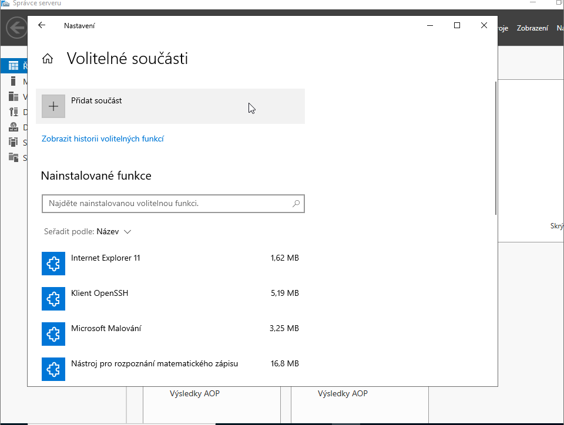

# Print Server (Print Server)

Installing the Print Server role and sharing a printer on the network for all domain clients.

## Step-by-Step Guide

### 1. Role Installation
In Server Manager add the "Print and Document Services" role. Check "Print Server" and complete the installation.

### 2. Print Management Setup
Open "Print Management", add a printer via TCP/IP port and enter the printer IP address.

> [!TIP]
> The shared printer will be available to clients via \ServerName\PrinterName or automatically via Group Policy.

## Troubleshooting & FAQ

#### Printer was added but clients cannot see it.
> **Solution:** Check if the printer is shared: in Print Management right-click the printer → Properties → Sharing → check "Share this printer". Clients will then find the printer via \ServerName.

#### Adding printer via TCP/IP fails — "Device not found".
> **Solution:** In VirtualBox a virtual printer has no real IP. For testing add the printer as "Generic / Text Only" without a TCP/IP port, or use a virtual PDF printer.

---
[ Back to Overview](../../README.md)