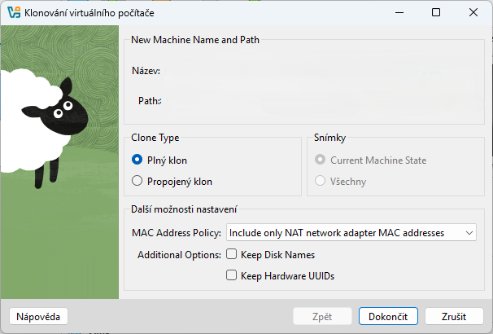

# VM Cloning (Cloning a Virtual Machine)

How to quickly create a copy of an existing VM in VirtualBox for deploying multiple clients.

## Step-by-Step Guide

### 1. Cloning Process
Shut down the source VM. In VirtualBox right-click the VM → Clone. Enter the clone name and choose "Full Clone".



> [!TIP]
> Full Clone = completely independent copy. Linked Clone shares the disk with the original — faster but dependent.

### 2. Hostname Change
After cloning is complete, start the new VM. Change the hostname to avoid network conflicts.

```powershell
# Change hostname in PowerShell (run as admin):
Rename-Computer -NewName "CLIENT-02" -Restart
```

### 3. IP Configuration
Check and change the IP address if you are not using DHCP.

```powershell
# View current IP configuration:
ipconfig /all

# Release and renew DHCP address:
ipconfig /release
ipconfig /renew
```

## Troubleshooting & FAQ

#### Clone has the same name as the original — network conflicts occur.
> **Solution:** After cloning always change the hostname: Win+Pause → Rename this PC. Two machines with the same name in a domain will cause problems.

#### Clone cannot join the domain — "Computer account already exists".
> **Solution:** The clone inherited the SID and computer account from the original. In ADUC on the server delete the old computer account and join the clone again as a new machine.

#### Linked Clone does not work after moving or deleting the original.
> **Solution:** Linked Clone depends on the original — without it you cannot start it. Always use Full Clone for independent copies.

---
[ Back to Overview](../../README.md)