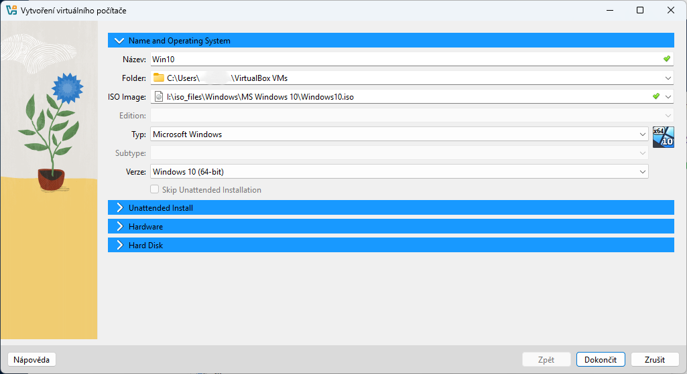

# VM Setup (Creating a Virtual Machine)

How to create a new VM in VirtualBox and add a second network adapter for communication between machines.

## Step-by-Step Guide

### 1. VM Creation
Open VirtualBox and click "New". Enter a name, type (Microsoft Windows) and version (Windows 2019). Allocate RAM and create a virtual disk.

> [!TIP]
> Recommended RAM: 2 GB for server, 1 GB for client. Disk: 50 GB for server, 30 GB for client.

### 2. Network Configuration
After creating the VM, add a second network adapter: Settings → Network → Adapter 2 → Enable. Choose "Internal Network" for VM-to-VM communication.

> [!TIP]
> Adapter 1 = NAT (internet access), Adapter 2 = Internal Network (VM-to-VM communication).

## Troubleshooting & FAQ

#### VMs cannot communicate — ping does not work.
> **Solution:** Most often a forgotten Adapter 2. Check Settings → Network → Adapter 2 — must be enabled and set to "Internal Network". Both VMs must use the same network name (default is "intnet").

#### VM starts but immediately freezes or is extremely slow.
> **Solution:** Not enough RAM or CPU allocated. Shut down the VM and in Settings → System increase RAM (min. 2 GB for server) and add CPU cores. Also check that virtualization is enabled in BIOS (VT-x/AMD-V).

#### VirtualBox reports "VT-x is disabled in the BIOS".
> **Solution:** Restart the computer, enter BIOS (Del/F2/F12) and enable Intel VT-x or AMD-V. Without this you cannot run 64-bit VMs.

---
[ Back to Overview](../../README.md)