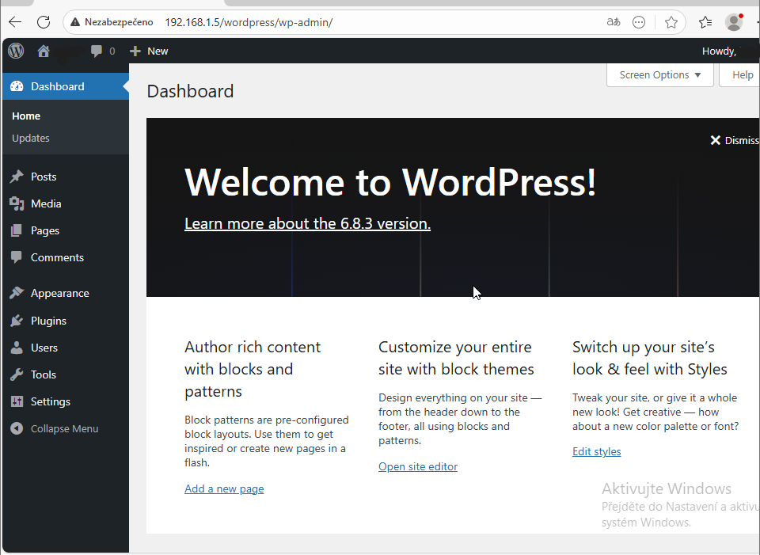

# Instalace WordPressu na Ubuntu (LAMP stack)

Kompletní postup instalace webové prezentace běžící na systému WordPress v prostředí Ubuntu Serveru. Tento proces zahrnuje nastavení webového serveru Apache, databáze MariaDB, interpretu PHP a samotného CMS WordPress.

## Podrobný postup instalace

### 1. Webový server Apache
Aktualizujte seznam balíčků a nainstalujte Apache2. Po instalaci povolte jeho spuštění při startu systému.

```bash
sudo apt update
sudo apt upgrade -y
sudo apt install apache2 -y
sudo systemctl enable apache2
sudo systemctl start apache2
```

> [!NOTE]
> Funkčnost serveru Apache si můžete ověřit v prohlížeči zadáním IP adresy vašeho serveru. Měla by se zobrazit "Apache2 Ubuntu Default Page".

### 2. Databázový server MariaDB
Pro uložení obsahu WordPressu je nezbytný databázový server. Po instalaci spusťte bezpečnostní skript.

```bash
sudo apt install mariadb-server -y
sudo mysql_secure_installation
```

> [!IMPORTANT]
> Během konfigurace se doporučuje zvolit následující:
> - Nastavit heslo pro root: **Y**
> - Odebrat anonymní uživatele: **Y**
> - Zakázat vzdálené přihlášení pro uživatele root: **Y**
> - Odstranit testovací databázi: **Y**

### 3. Příprava databáze a uživatele
Přihlaste se do konzole MariaDB a vytvořte vyhrazenou databázi a uživatele s dostatečnými oprávněními pro WordPress.

```sql
sudo mysql
-- Vytvoření databáze s podporou kódování UTF-8
CREATE DATABASE wordpress CHARACTER SET utf8mb4 COLLATE utf8mb4_unicode_ci;

-- Vytvoření uživatele a nastavení hesla
CREATE USER 'wpuser'@'localhost' IDENTIFIED BY 'SilneHeslo123!';

-- Přidělení práv uživateli k databázi
GRANT ALL PRIVILEGES ON wordpress.* TO 'wpuser'@'localhost';
FLUSH PRIVILEGES;
EXIT;
```

### 4. Instalace PHP a podpůrných modulů
WordPress pro svůj běh vyžaduje jazyk PHP a několik jeho rozšiřujících modulů pro práci s databází, grafikou a XML soubory.

```bash
sudo apt install php libapache2-mod-php php-mysql php-curl php-gd php-mbstring php-xml php-xmlrpc php-soap php-intl php-zip -y
sudo systemctl restart apache2
```

### 5. Stažení a příprava WordPressu
Stáhněte si nejnovější verzi WordPressu přímo z oficiálních stránek, rozbalte ji do složky webového serveru a nastavte správného vlastníka souborů (uživatel `www-data`).

```bash
cd /tmp
sudo wget https://wordpress.org/latest.tar.gz
sudo tar -xvzf latest.tar.gz
sudo mv wordpress /var/www/wordpress
sudo chown -R www-data:www-data /var/www/wordpress
sudo chmod -R 755 /var/www/wordpress
```

### 6. Konfigurace Apache VirtualHost
Aby webový server věděl, odkud má soubory WordPressu načítat, vytvořte konfigurační soubor.

```bash
sudo nano /etc/apache2/sites-available/wordpress.conf
```

> [!NOTE]
> Vložte následující obsah a uložte (Ctrl+O, Enter, Ctrl+X):
> ```apache
> <VirtualHost *:80>
>   ServerAdmin admin@example.com
>   DocumentRoot /var/www/wordpress
>   <Directory /var/www/wordpress>
>     AllowOverride All
>     Require all granted
>   </Directory>
>   ErrorLog ${APACHE_LOG_DIR}/wordpress_error.log
>   CustomLog ${APACHE_LOG_DIR}/wordpress_access.log combined
> </VirtualHost>
> ```

### 7. Aktivace webu a mod_rewrite
Aktivujte novou konfiguraci, povolte modul pro přepisování URL adres (rewrite) a restartujte Apache.

```bash
sudo a2ensite wordpress.conf
sudo a2enmod rewrite
sudo a2dissite 000-default.conf
sudo systemctl restart apache2
```

### 8. Nastavení souboru wp-config.php
Vytvořte konfigurační soubor WordPressu na základě dodávaného vzoru a vyplňte v něm přístupové údaje k databázi.

```bash
cd /var/www/wordpress
sudo cp wp-config-sample.php wp-config.php
sudo nano wp-config.php
```

> [!WARNING]
> V souboru upravte položky `DB_NAME` na "wordpress", `DB_USER` na "wpuser" a `DB_PASSWORD` na vaše zvolené heslo.

### 9. Nastavení firewallu
Ujistěte se, že firewall ufw propouští HTTP (TCP port 80).

```bash
sudo ufw allow Apache
sudo ufw enable
sudo systemctl reload apache2
```

### 10. Dokončení instalace ve webovém prohlížeči
Přejděte v prohlížeči na adresu `http://ip_vaseho_serveru` a postupujte podle pokynů instalátoru WordPressu (výběr jazyka, název webu, vytvoření administrátora).



## Troubleshooting — Řešení častých potíží

#### Prohlížeč zobrazuje výchozí stránku Apache namísto WordPressu.
> [!NOTE]
> Ujistěte se, že jste deaktivovali výchozí konfigurační soubor: `sudo a2dissite 000-default.conf` a následně restartovali Apache: `sudo systemctl reload apache2`.

#### WordPress nemůže nahrávat média nebo instalovat pluginy.
> [!WARNING]
> Příčinou jsou obvykle špatná oprávnění. Zkontrolujte, zda je vlastníkem složky `/var/www/wordpress` uživatel **www-data**: `sudo chown -R www-data:www-data /var/www/wordpress`.

[Zpět na přehled](../../README.md)
