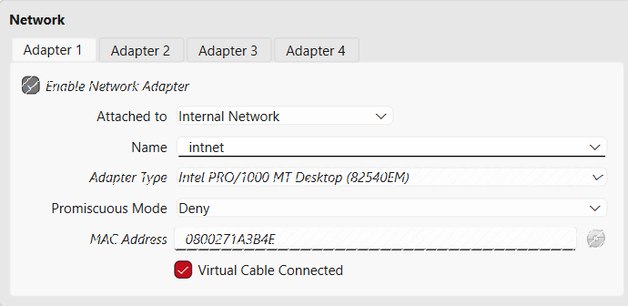
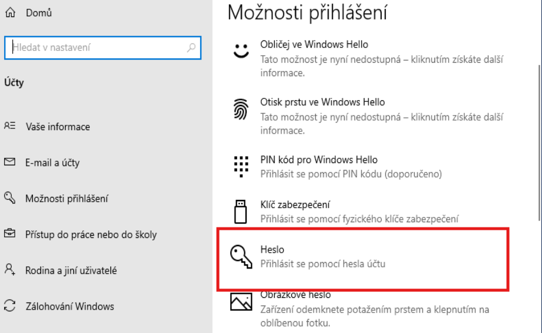
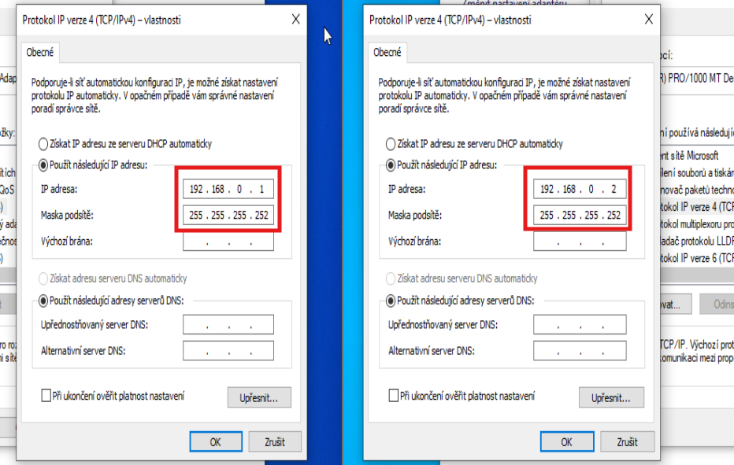
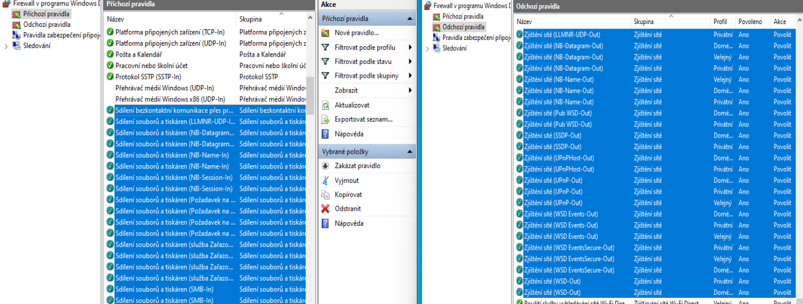
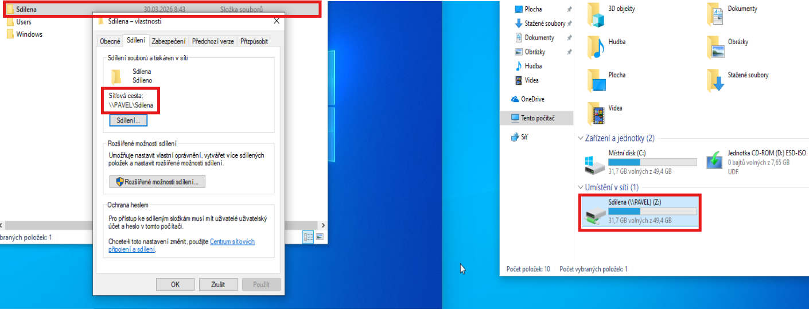
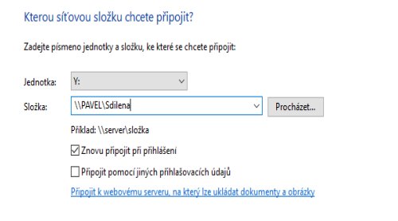
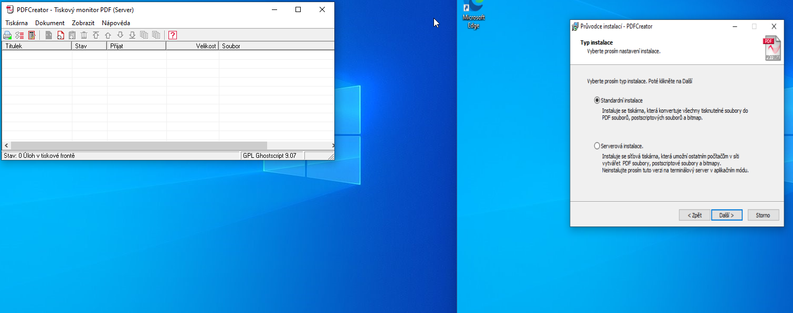
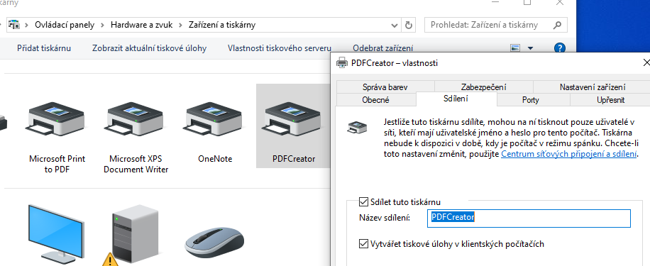
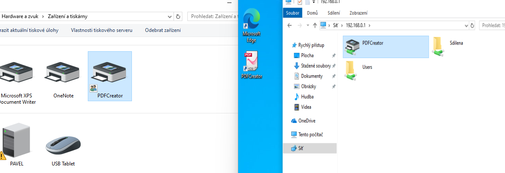

# P2P propojení a zabezpečení ve VirtualBoxu

Komplexní návod na vytvoření peer-to-peer sítě mezi dvěma virtuálními stroji s Windows 10/11, včetně sdílení souborů, tiskáren a instalace PDF Creatoru.

---

## Obsah

1. [Konfigurace VirtualBoxu](#1-konfigurace-virtualboxu)
2. [Příprava systému a identita](#2-příprava-systému-a-identita)
3. [Síťové parametry (Statické IP)](#3-síťové-parametry-statické-ip)
4. [Nastavení Firewallu](#4-nastavení-firewallu)
5. [Vytvoření sdíleného bodu](#5-vytvoření-sdíleného-bodu)
6. [Připojení síťové jednotky](#6-připojení-síťové-jednotky)
7. [Instalace PDF Creatoru](#7-instalace-pdf-creatoru)
8. [Sdílení tiskárny](#8-sdílení-tiskárny)
9. [Řešení problémů](#řešení-problémů)
10. [Užitečné odkazy](#užitečné-odkazy)

---

## 1. Konfigurace VirtualBoxu

Aby spolu počítače mohly komunikovat v izolovaném prostředí, musíme je umístit do stejné virtuální sítě.

### Postup

1. U **obou VM** přejděte do **Nastavení** → **Síť**
2. Nastavte následující parametry:

| Parametr | Hodnota |
|----------|---------|
| Připojeno k | **Vnitřní síť** (Internal Network) |
| Název | `intnet` (musí být u obou stejný) |

3. V sekci **Pokročilé** klikněte na ikonu modrých šipek (Refresh) u položky **MAC adresa**, aby měl každý stroj unikátní identifikátor.




> **Tip:** Internal Network vytváří izolovanou síť pouze mezi VM - nemají přístup k internetu ani k hostitelskému systému.

---

## 2. Příprava systému a identita

Po spuštění Windows je potřeba stroje pojmenovat a zabezpečit.

### Změna názvu počítače

1. Přejděte do **Nastavení** → **Systém** → **O systému**
2. Klikněte na **Přejmenovat tento počítač**

| Počítač | Název |
|---------|-------|
| PC 1 | `KLIENT1` |
| PC 2 | `KLIENT2` |



### Nastavení hesla

Oba uživatelské účty musí mít nastavené heslo pro možnost síťového sdílení.

1. **Nastavení** → **Účty** → **Možnosti přihlášení** → **Heslo**
2. Nastavte heslo (např. `Heslo11!`)


> **Důležité:** Windows vyžaduje heslo pro síťové přihlášení. Bez hesla nebude možné se připojit ke sdíleným prostředkům.

---

## 3. Síťové parametry (Statické IP)

Protože ve vnitřní síti obvykle neběží DHCP server, musíme adresy zadat ručně.

### Postup konfigurace

1. Přejděte do: **Ovládací panely** → **Síť a internet** → **Síťová připojení**
2. Pravým tlačítkem na síťový adaptér → **Vlastnosti**
3. Vyberte **Protokol IP verze 4 (TCP/IPv4)** → **Vlastnosti**


### Tabulka IP adres

| Parametr | KLIENT1 | KLIENT2 |
|----------|---------|---------|
| IP adresa | `192.168.0.1` | `192.168.0.2` |
| Maska podsítě | `255.255.255.252` | `255.255.255.252` |
| Výchozí brána | *ponechte prázdné* | *ponechte prázdné* |



> **Poznámka:** Maska `/30` (255.255.255.252) umožňuje pouze 2 použitelné adresy - ideální pro P2P propojení.

### Ověření konektivity

Po konfiguraci otestujte spojení pomocí příkazového řádku:

```cmd
ping 192.168.0.2    # z KLIENT1
ping 192.168.0.1    # z KLIENT2
```

---

## 4. Nastavení Firewallu

Povolíme systému "vidět a být viděn". Toto nastavení proveďte na **obou stranách**.

### Postup

1. Otevřete **Windows Defender Firewall** → **Upřesnit nastavení**
2. V **Příchozích** i **Odchozích pravidlech** vyhledejte a povolte následující pravidla:

| Pravidlo | Anglický název |
|----------|----------------|
| Sdílení souborů a tiskáren | File and Printer Sharing |
| Zjišťování sítě | Network Discovery |

3. Pravým tlačítkem → **Povolit pravidlo**





---

## 5. Vytvoření sdíleného bodu

Na počítači **KLIENT1** vytvoříme sdílenou složku.

### Postup

1. Vytvořte libovolnou složku (např. `C:\Sdilena`)
2. Pravým tlačítkem → **Vlastnosti** → karta **Sdílení**
3. Klikněte na tlačítko **Sdílet...**
4. Přidejte sebe nebo `Everyone` a nastavte úroveň oprávnění


### Rozšířené sdílení

1. Klikněte na **Rozšířené sdílení**
2. Zaškrtněte **Sdílet tuto složku**
3. Potvrďte název sdílení: `\\KLIENT1\Sdilena`


---

## 6. Připojení síťové jednotky

Na počítači **KLIENT2** se připojíme ke sdílené složce.

### Postup

1. Otevřete **Tento počítač**
2. V horním menu klikněte na **Připojit síťovou jednotku**
3. Zadejte cestu: `\\KLIENT1\Sdilena` nebo `\\192.168.0.1\Sdilena`
4. Zaškrtněte **Připojit pomocí jiných přihlašovacích údajů**



### Přihlašovací údaje

| Pole | Hodnota |
|------|---------|
| Uživatelské jméno | *(uživatelské jméno na KLIENT1)* |
| Heslo | `Heslo11!` |


---

## 7. Instalace PDF Creatoru

PDF Creator umožňuje vytvářet PDF soubory pomocí virtuální tiskárny.

### Na KLIENT1 (Serverová část)

1. Spusťte instalátor PDF Creatoru
2. V průvodci zaškrtněte **Expert settings** (Expertní nastavení)
3. Zvolte typ instalace **Server installation**
4. Dokončete instalaci




> Tímto se vytvoří virtuální tiskárna, která bude sloužit jako tiskový uzel.

### Na KLIENT2 (Standardní část)

1. Spusťte instalátor z disku
2. Zvolte **Standard installation** (Standardní instalace)
3. Dokončete instalaci

---

## 8. Sdílení tiskárny

### Na KLIENT1 - Sdílení tiskárny

1. Přejděte do **Ovládací panely** → **Zařízení a tiskárny**
2. Pravým tlačítkem na tiskárnu PDFCreator → **Vlastnosti tiskárny**
3. Karta **Sdílení** → zaškrtněte **Sdílet tuto tiskárnu**
4. Název ponechte např. `PDFCreator`



### Na KLIENT2 - Připojení tiskárny

1. Otevřete **Tento počítač**
2. Do adresního řádku napište `\\192.168.0.1`
3. Měli byste vidět sdílenou tiskárnu
4. Pravým tlačítkem → **Připojit**




---

## Řešení problémů

### Nelze pingnout druhý počítač

1. Zkontrolujte, zda jsou obě VM ve stejné Internal Network
2. Ověřte správnost IP adres a masky
3. Zkontrolujte, zda je firewall nastaven správně

### Nelze se připojit ke sdílené složce

1. Ověřte, že má uživatel na KLIENT1 nastavené heslo
2. Zkontrolujte oprávnění sdílení
3. Vypněte dočasně firewall pro diagnostiku

### Tiskárna není viditelná

1. Zkontrolujte, zda je tiskárna sdílena
2. Ověřte síťové připojení pomocí `\\IP_adresa`
3. Restartujte službu **Zařazování tisku** (Print Spooler)

```cmd
net stop spooler
net start spooler
```

---

## Užitečné odkazy

### Instalace Windows ve VirtualBoxu
- [Instructables: Instalace Windows 10 na VirtualBox](https://www.instructables.com/GuideHow-to-Install-Windows-10-on-Oracle-VM-Virtua/) - Podrobný průvodce s obrázky
- [Kubuntu Focus: VirtualBox W10 Guide](https://kfocus.org/wf/vbox.html) - Profesionální návod krok za krokem

### Síťové nastavení a sdílení
- [Stack Overflow: VirtualBox Internal Network](https://stackoverflow.com/questions/21069908/how-to-create-a-connection-between-two-virtual-machines-in-virtualbox) - Diskuze o propojení VM
- [Reddit r/VirtualBox: Networking Guide](https://www.reddit.com/r/virtualbox/comments/8z3hy4/networking_two_vms_together/) - Komunitní tipy pro síťování VM

### Windows File Sharing
- [Microsoft Docs: Sdílení souborů](https://support.microsoft.com/cs-cz/windows/sd%C3%ADlen%C3%AD-soubor%C5%AF-v-pr%C5%AFzkumn%C3%ADku-soubor%C5%AF-c49f5db4-3d71-4a43-b8bb-4c58c9a6d8c8) - Oficiální dokumentace
- [Stack Overflow: Windows File Sharing](https://stackoverflow.com/questions/tagged/windows-file-sharing) - Řešení běžných problémů

### PDF Creator
- [PDF Creator Documentation](https://docs.pdfforge.org/pdfcreator/en/) - Oficiální dokumentace
- [Reddit r/sysadmin: PDF Creator Deployment](https://www.reddit.com/r/sysadmin/comments/fwjxl8/pdfcreator_network_printer/) - Diskuze o síťovém nasazení

---

## Shrnutí

Po dokončení tohoto návodu budete mít:

- Dva propojené virtuální stroje v izolované síti
- Funkční sdílení souborů mezi počítači
- Sdílenou PDF tiskárnu dostupnou z obou strojů
- Zabezpečené připojení pomocí hesel

Toto nastavení je ideální pro testování síťových konfigurací, vývoj aplikací nebo vzdělávací účely.
