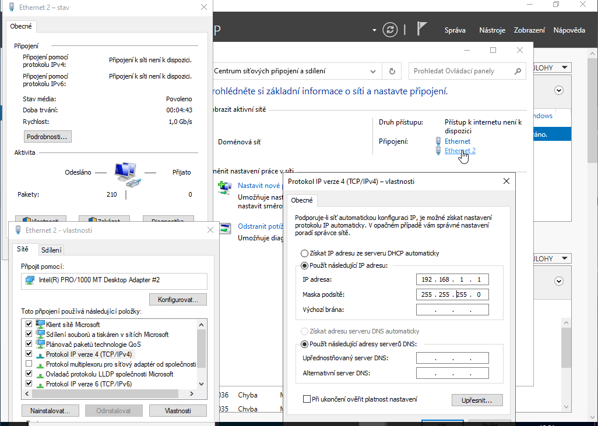
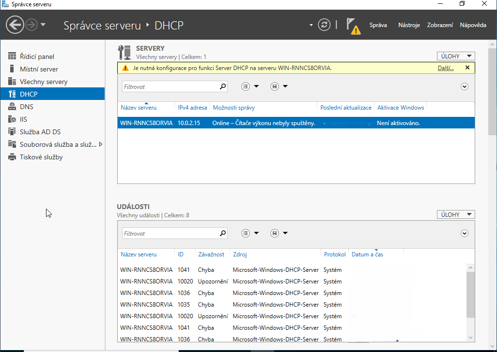
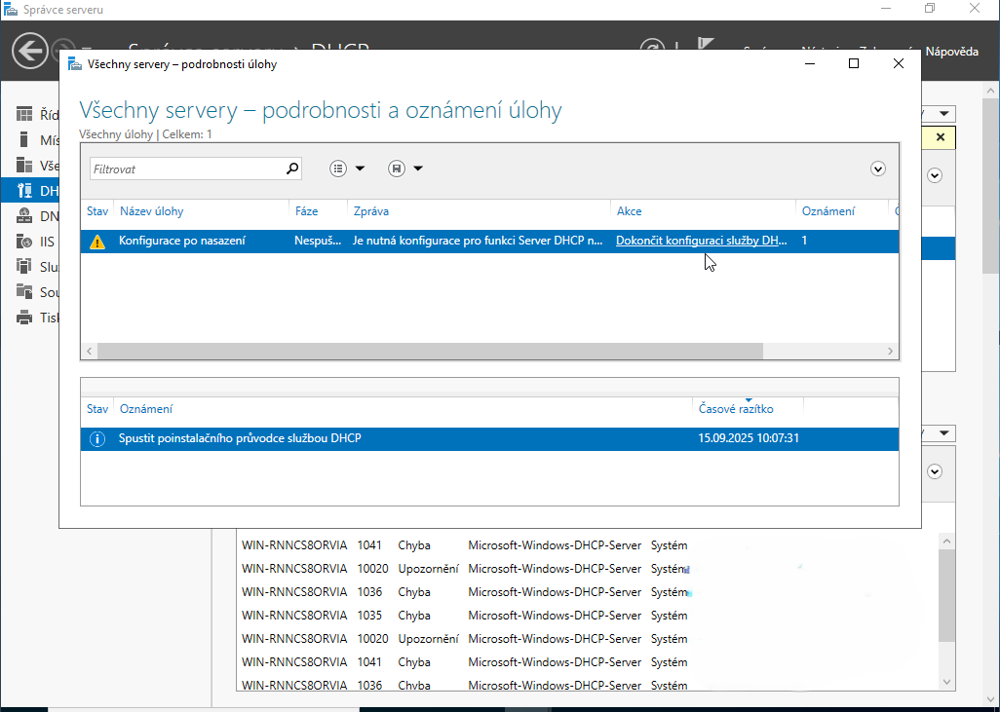
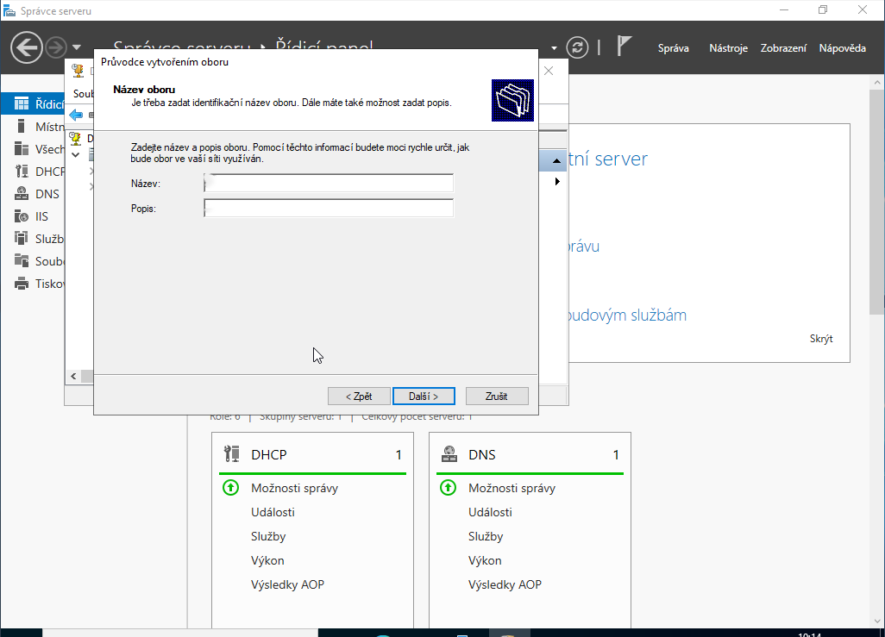
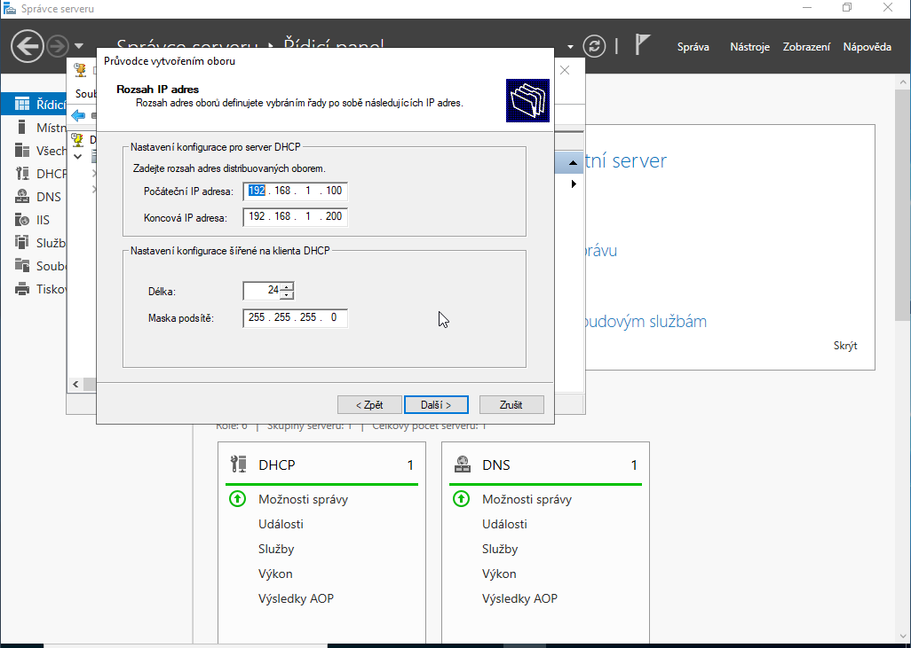
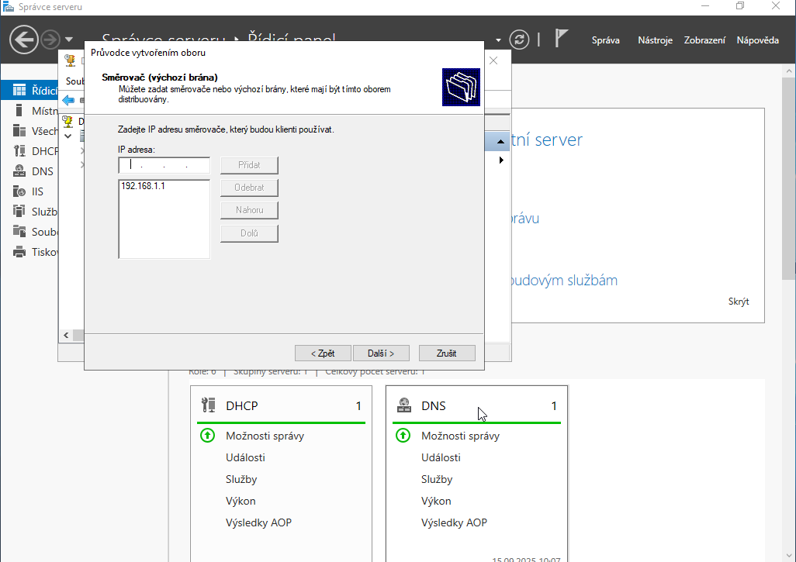
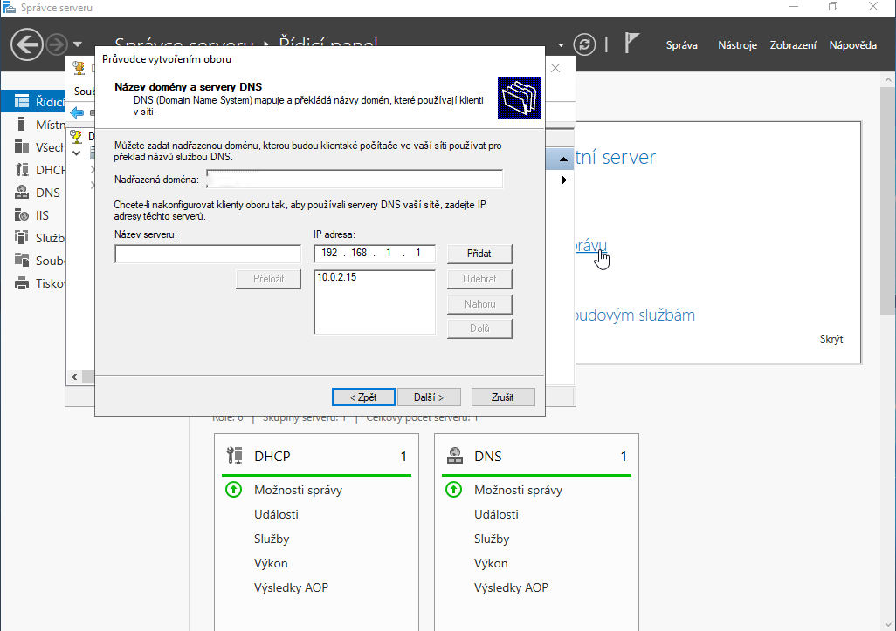
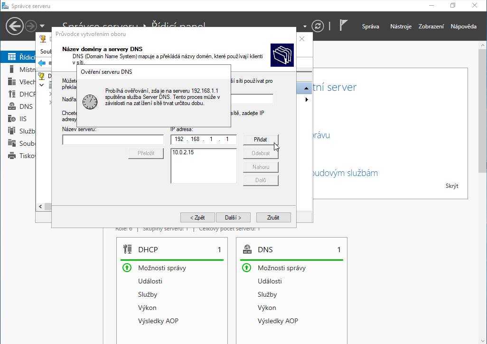
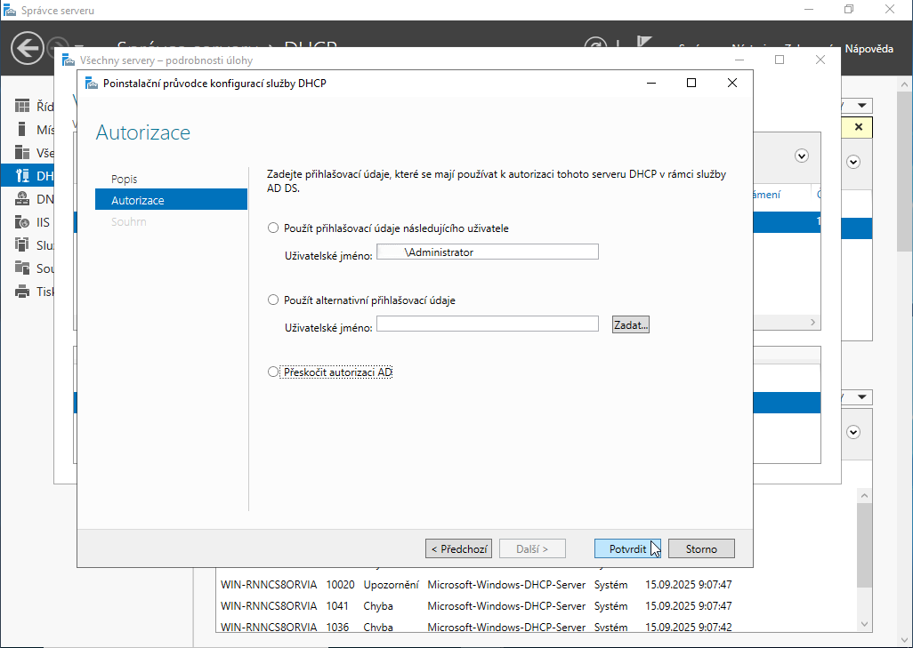

# Konfigurace DHCP serveru a statické IP adresy

Tento dokument detailně popisuje proces nastavení statické IP adresy serveru a následnou instalaci a konfiguraci role DHCP pro automatické přidělování IP adres klientským stanicím v doménové síti.

## Podrobný postup konfigurace

### 1. Nastavení statické IP adresy serveru
Před instalací jakýchkoli síťových rolí (zejména DHCP a DNS) je naprosto nezbytné, aby měl server pevně definovanou statickou IP adresu.
- Otevřete **Network and Sharing Center** → **Change adapter settings**.
- Pravým tlačítkem na adaptér vnitřní sítě → **Properties** → **Internet Protocol Version 4 (TCP/IPv4)**.
- Vyplňte údaje ručně (např. IP: `192.168.1.1`, Maska: `255.255.255.0`).

> [!IMPORTANT]
> Pro správnou funkci Active Directory musí být jako primární DNS server nastavena adresa `127.0.0.1` (nebo statická IP serveru), nikoli IP adresa externího routeru.

### 2. Instalace role DHCP Server
Instalace probíhá skrze Server Manager.
- V menu **Manage** zvolte **Add Roles and Features**.
- V seznamu rolí zaškrtněte **DHCP Server** a potvrďte přidání funkcí.
- Po dokončení klikněte na žlutou notifikaci a proveďte **Complete DHCP configuration** (autorizace serveru v AD).

### 3. Vytvoření a konfigurace nového oboru (Scope)
Obor definuje logickou množinu adres, které budou klientům zapůjčovány.
- Otevřete konzoli **DHCP Manager** (Tools → DHCP).
- Pravým tlačítkem na **IPv4** → **New Scope...**.
- Spustí se průvodce, kde definujete název oboru (např. `Klienti-Ucebna`).

### 4. Definice rozsahu zapůjčovaných adres
Určete počáteční a koncovou IP adresu fondu.
- Start IP: `192.168.1.100`
- End IP: `192.168.1.200`
- Maska: `255.255.255.0` (Length: 24)

> [!NOTE]
> IP adresa serveru (`192.168.1.1`) musí být mimo tento rozsah, aby nedocházelo ke kolizím.

### 5. Nastavení vyloučených adres (Exclusions)
Vyloučení slouží pro adresy uvnitř rozsahu, které chcete rezervovat pro zařízení se statickou IP (např. tiskárny).

### 6. Doba zapůjčení (Lease Duration)
Doba zapůjčení určuje, jak dlouho si klient ponechá přidělenou adresu, než požádá o obnovu. Pro stabilní kancelářskou síť je optimální výchozích 8 dní.

### 7. Aktivace oboru a konfigurace DHCP Options
V tomto kroku nastavíte klíčové parametry, které klient obdrží spolu s IP adresou:
- **Router (Default Gateway):** `192.168.1.1`
- **DNS Server:** `192.168.1.1`
- **Parent Domain:** Vaše doména (např. `skola.local`)

### 8. Verifikace stavu a monitorování
Aktivní obor je indikován zelenou šipkou. V záložce **Address Leases** můžete v reálném čase sledovat, kteří klienti získali adresu.

## Diagnostika a řešení potíží (Troubleshooting)

### Klient nezískal adresu (APIPA 169.254.x.x)
> [!WARNING]
> Zkontrolujte, zda je klient i server v režimu **Internal Network** ve VirtualBoxu. Pokud klient stále nemá adresu, použijte v příkazovém řádku klienta příkaz `ipconfig /renew`.

### Server není autorizován
> [!IMPORTANT]
> Pokud je u názvu serveru v DHCP konzoli červená ikona, server pravděpodobně není autorizován v AD. Klikněte pravým tlačítkem na název serveru → **Authorize**.

### Konflikt s jiným DHCP serverem
> [!TIP]
> Pokud máte v síti více DHCP serverů (např. aktivní NAT adaptér ve VirtualBoxu), může docházet ke kolizím. Doporučujeme u klientů dočasně deaktivovat adaptér NAT a ponechat pouze vnitřní síť pro ověření funkčnosti doménového DHCP.

---

## Užitečné odkazy

### Oficiální dokumentace
- [Microsoft Docs: DHCP](https://docs.microsoft.com/en-us/windows-server/networking/technologies/dhcp/dhcp-top) - Kompletní reference
- [Microsoft Learn: Deploy DHCP](https://docs.microsoft.com/en-us/windows-server/networking/technologies/dhcp/dhcp-deploy-wps) - Instalační průvodce

### Návody a tutoriály
- [Server Fault: DHCP Configuration](https://serverfault.com/questions/tagged/dhcp) - Q&A pro administrátory
- [TechRepublic: DHCP Setup](https://www.techrepublic.com/article/how-to-configure-dhcp-in-windows-server/) - Podrobný návod

### Komunita a řešení problémů
- [Stack Overflow: DHCP](https://stackoverflow.com/questions/tagged/dhcp) - Řešení technických problémů
- [Reddit r/sysadmin](https://www.reddit.com/r/sysadmin/search/?q=dhcp%20windows%20server) - Diskuze administrátorů
- [Spiceworks Community](https://community.spiceworks.com/networking/dhcp) - IT komunita

---
[Zpět na přehled](../../README.md)
