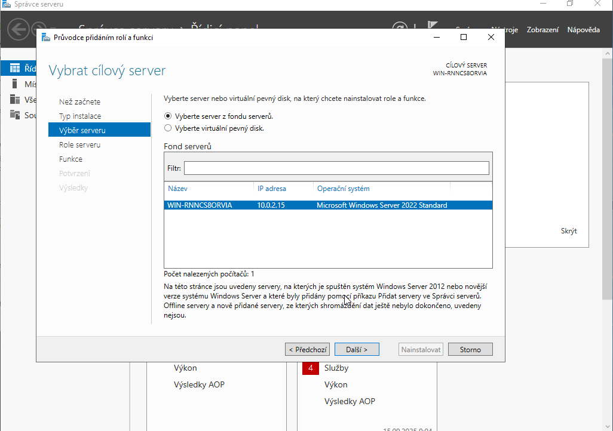
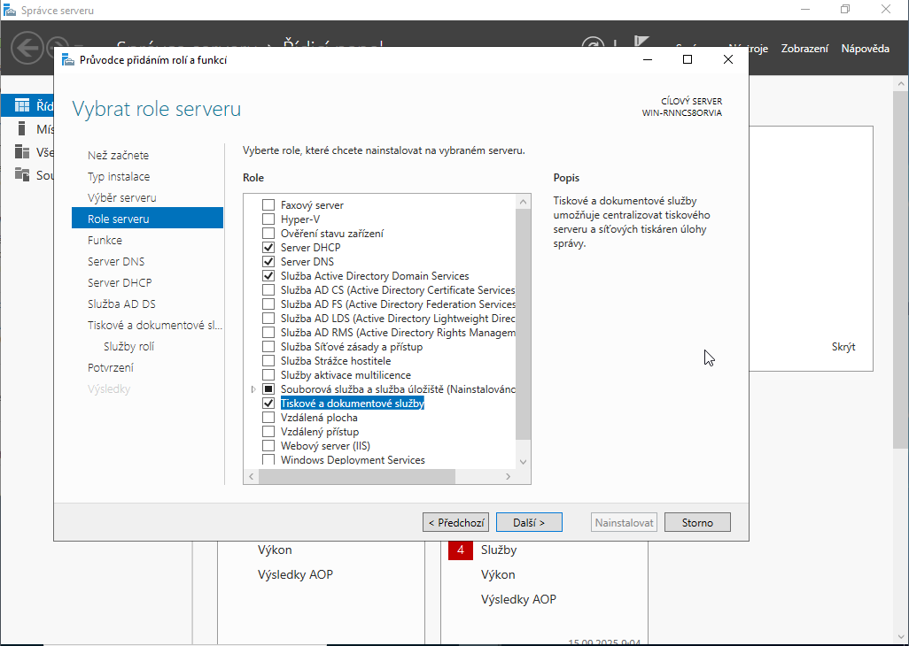
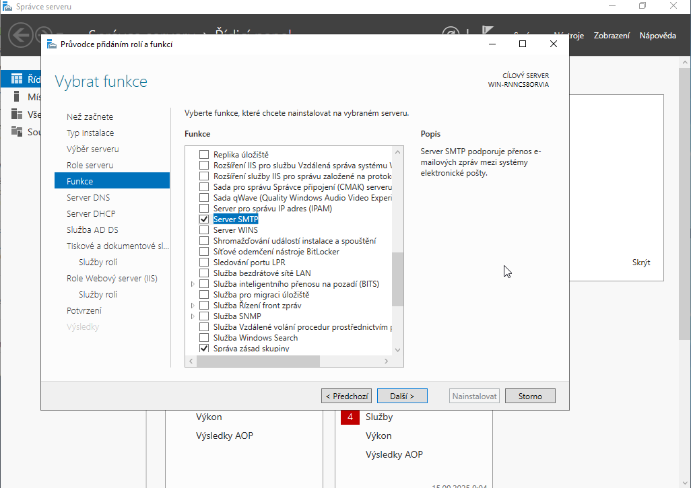
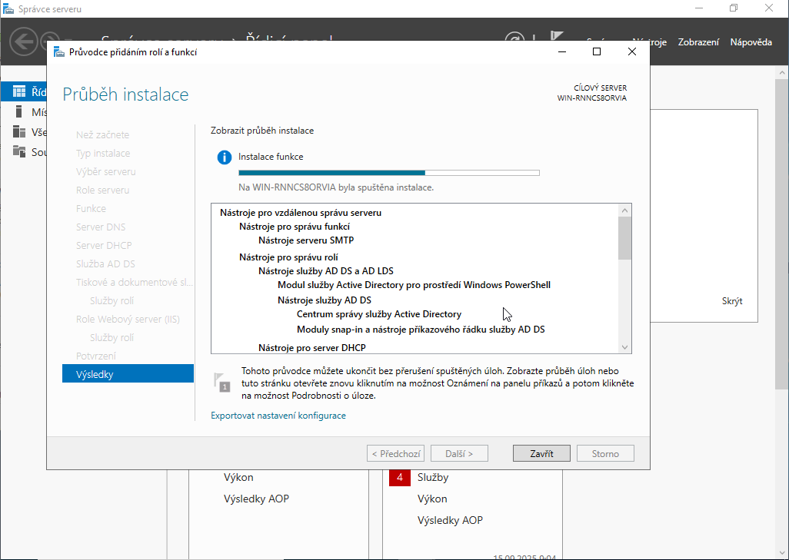
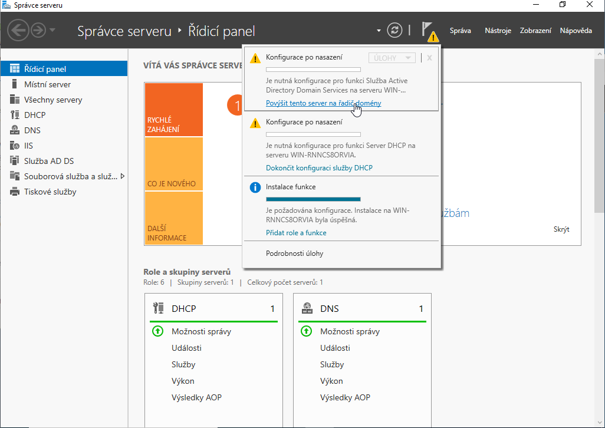
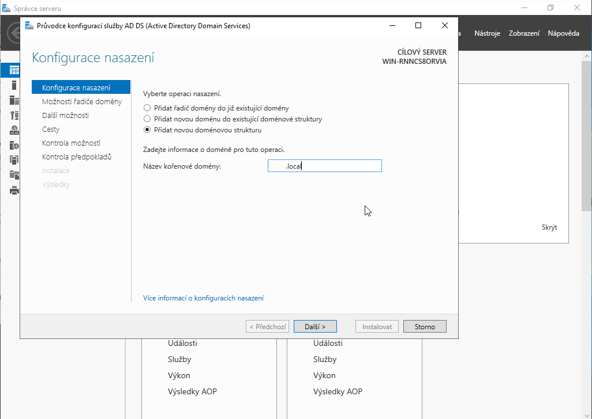
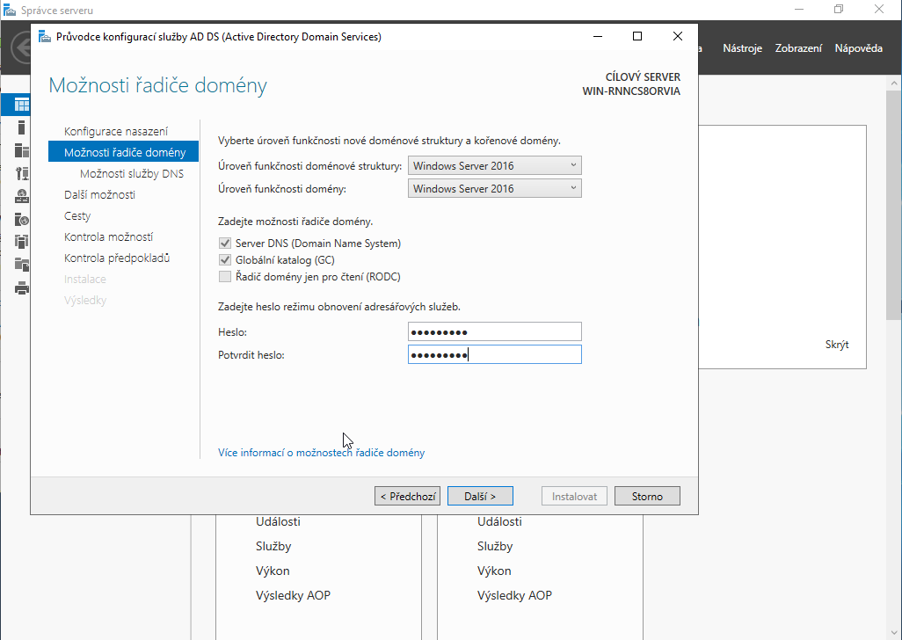
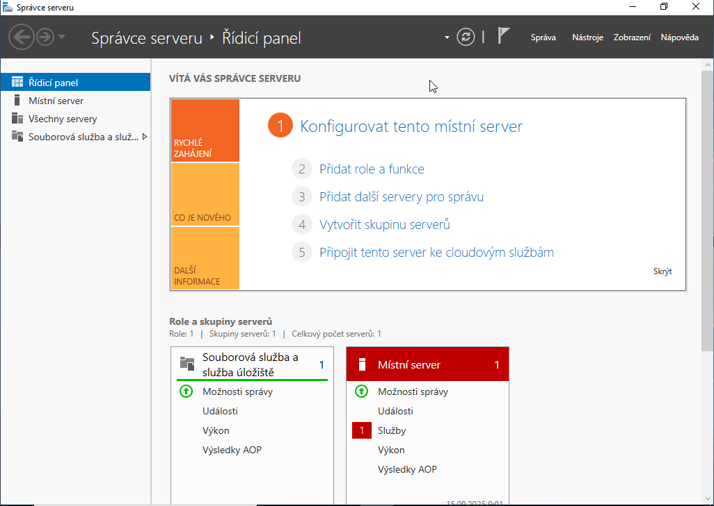

# Instalace řadiče domény a Active Directory Domain Services (AD DS)

Tento dokument detailně popisuje proces povýšení serveru na řadič domény (Domain Controller), instalaci role Active Directory a následnou konfiguraci doménové infrastruktury.

## Předpoklady pro instalaci (Prerequisites)

Před zahájením instalace AD DS musí server splňovat následující technické požadavky:
- **Statická IP adresa:** Musí být nastavena v IPv4 vlastnostech adaptéru vnitřní sítě.
- **Hostname:** Server by měl mít definován smysluplný název (např. `SVR-DC-01`) před instalací role.
- **Administrátorské oprávnění:** Uživatel musí být členem lokální skupiny Administrators.

## Podrobný postup konfigurace

### 1. Spuštění průvodce přidáním rolí a funkcí
V horním menu **Server Manageru** klikněte na položku **Manage** a následně vyberte **Add Roles and Features**. Spustí se průvodce, který vás provede procesem instalace binárních souborů.

### 2. Výběr typu instalace a serveru
Zvolte typ instalace **Role-based or feature-based installation**. V dalším kroku vyberte lokální server ze seznamu (poolu) dostupných serverů.

### 3. Výběr role Active Directory Domain Services
V seznamu dostupných rolí vyhledejte a zaškrtněte položku **Active Directory Domain Services**. Systém automaticky nabídne přidání závislých funkcí (např. Group Policy Management, AD DS Tools). Klikněte na **Add Features**.

### 4. Průběh instalace binárních souborů
Zkontrolujte shrnutí konfigurace a potvrďte instalaci kliknutím na **Install**. V této fázi dochází k nakopírování binárních souborů role AD DS na lokální disk serveru. Po dokončení není role ještě aktivní; je vyžadována další konfigurace.

### 5. Povýšení serveru na řadič domény (Promotion)
Po úspěšné instalaci klikněte na žlutou výstražnou ikonu (Notification) v horní liště Server Manageru a vyberte možnost **Promote this server to a domain controller**.

> [!WARNING]
> Tato operace je nevratná bez kompletní reinstalace OS nebo degradace role. Před pokračováním se ujistěte, že je server připojen do správného síťového segmentu (Internal Network).

### 6. Vytvoření nového lesa a název domény
V průvodci konfigurací (**Deployment Configuration**) vyberte možnost **Add a new forest**. Zadejte kořenový název domény (např. `skola.local` nebo `test.lan`).

> [!NOTE]
> Pro vnitřní testovací prostředí se doporučuje používat přípony `.local` nebo `.internal`, aby nedocházelo ke kolizi s externími DNS záznamy ve veřejném internetu.

### 7. Režim obnovy a DNS delegace
Nastavte heslo pro **Directory Services Restore Mode (DSRM)**. Toto heslo je klíčové pro případnou obnovu databáze AD. Ujistěte se, že je zaškrtnuto **Install DNS Server**, což je nezbytná komponenta pro fungování AD.

### 8. Restart systému a doménové přihlášení
Dokončete průvodce a potvrďte restart systému. Po restartu trvá první spuštění déle z důvodu konfigurace databáze NTDS. Přihlášení proběhne pod účtem administrátora domény ve formátu `DOMENA\Administrator`.

### 9. Ověření finálního stavu
Po přihlášení zkontrolujte Server Manager. Ikony AD DS a DNS musí svítit zeleně. Ověřte také konzoli **Active Directory Users and Computers**, která je nyní dostupná v menu **Tools**.

## Diagnostika a řešení potíží (Troubleshooting)

### Chyba při kontrole prerekvizit
> [!IMPORTANT]
> Pokud průvodce selže v kroku "Prerequisites Check", nejčastěji chybí statická IP adresa. Server musí mít v nastavení IPv4 jako preferovaný DNS server nastavenou adresu `127.0.0.1` nebo svou vlastní statickou IP.

### DNS server neodpovídá
> [!WARNING]
> Pokud doménové služby nefungují, ověřte funkčnost DNS pomocí příkazu `nslookup` následovaného názvem domény. Pokud DNS záznamy chybí, zkontrolujte, zda je spuštěna služba **DNS Server** a zda jsou vytvořeny odpovídající zóny dopředného vyhledávání.

### Nedostupnost doménového přihlášení
> [!TIP]
> Pokud se po restartu zobrazuje pouze lokální uživatel, klikněte na **Other user** a zadejte jméno v plném formátu, např. `FIRMA\Administrator`. Heslo zůstává stejné jako heslo lokálního administrátora nastavené při instalaci systému.

---
[Zpět na přehled](../../README.md)
