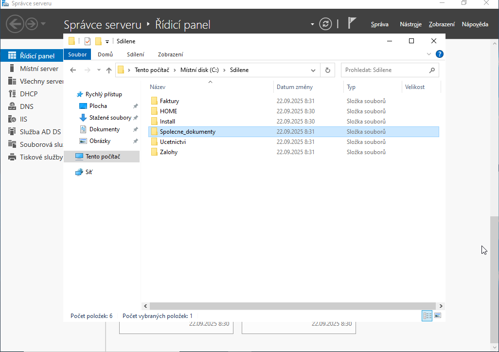
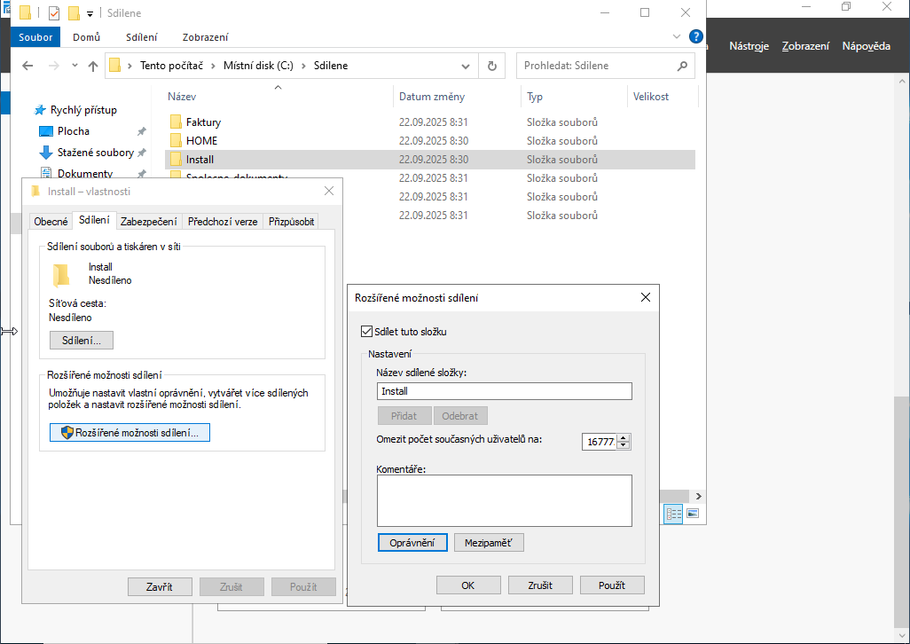
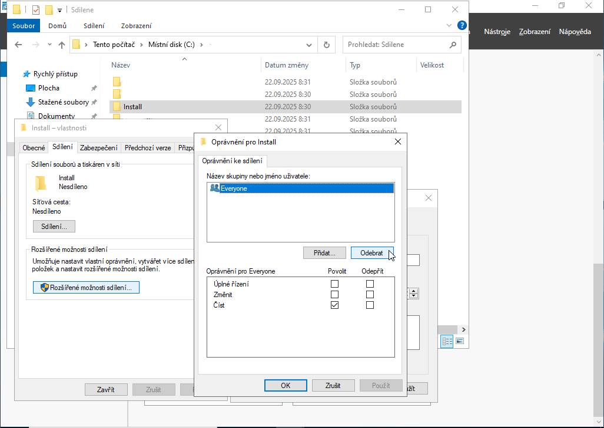
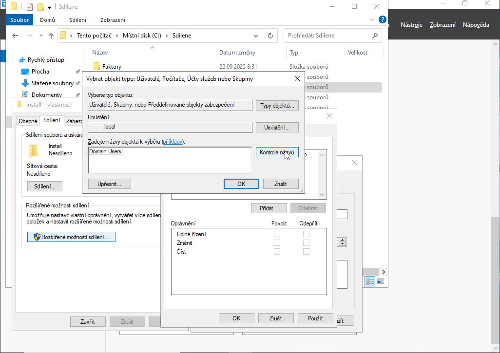
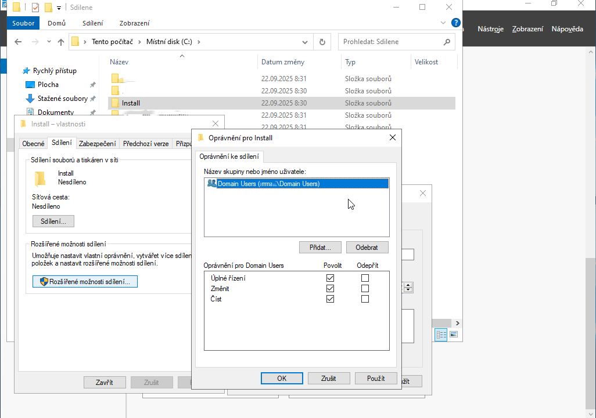
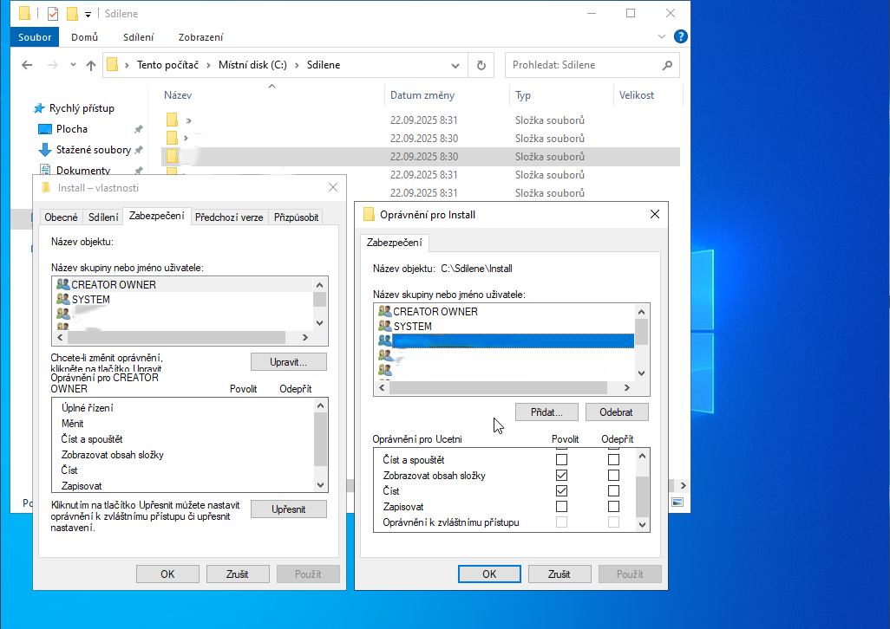

# Sdílení souborů a správa oprávnění NTFS

Tento dokument poskytuje detailní návod na konfiguraci sdílení souborů v prostředí Windows Server, včetně nastavení sdílených složek, oprávnění ke sdílení a zabezpečení na úrovni souborového systému NTFS.

## Podrobný postup konfigurace

### 1. Příprava adresářové struktury
Před samotným sdílením je nutné vytvořit logickou strukturu složek na datovém svazku serveru. Doporučuje se neukládat uživatelská data na systémový disk (C:), ale na dedikovaný datový oddíl.

> [!TIP]
> Pro lepší přehlednost vytvářejte složky podle organizační struktury firmy (např. Oddělení, Projekty, Veřejné).

### 2. Konfigurace pokročilého sdílení
Klikněte pravým tlačítkem na cílovou složku, zvolte **Properties** (Vlastnosti) a přejděte na kartu **Sharing** (Sdílení). Zde klikněte na **Advanced Sharing** (Rozšířené sdílení).

1. Zaškrtněte **Share this folder** (Sdílet tuto složku).
2. Definujte **Share name** (Název sdílené položky) – tento název uvidí uživatelé v síti.

### 3. Nastavení oprávnění sdílení
V okně pokročilého sdílení klikněte na tlačítko **Permissions** (Oprávnění).

> [!IMPORTANT]
> Z bezpečnostních důvodů vždy odstraňte výchozí skupinu **Everyone**. Místo ní přidejte konkrétní doménové skupiny, kterým chcete přístup umožnit.

### 4. Přidání doménových skupin
Pomocí tlačítka **Add** vyhledejte příslušné skupiny v Active Directory (např. `Domain Users`).

> [!NOTE]
> Pro zjednodušení správy se na úrovni sdílení (Share Permissions) doporučuje nastavit **Full Control** pro danou skupinu a samotné omezení přístupu (čtení/zápis) řešit až na úrovni NTFS.

### 5. Nastavení zabezpečení NTFS (Security)
Přepněte se na kartu **Security** (Zabezpečení) ve vlastnostech složky. Zde se definují skutečná oprávnění k souborům a podsložkám.

- **Read & execute**: Uživatel může číst a spouštět soubory.
- **Modify**: Uživatel může číst, zapisovat i mazat soubory.
- **Full control**: Uživatel má veškerá práva, včetně měnění oprávnění.

### 6. Verifikace a dokončení
Po potvrzení všech dialogových oken se složka začne sdílet. Cestu ke složce (UNC cesta) naleznete na kartě **Sharing**.

> [!WARNING]
> Výsledné oprávnění uživatele je vždy nejvíce omezující kombinací (průnikem) oprávnění sdílení a oprávnění NTFS. Pokud má uživatel na sdílení "Read" a na NTFS "Full Control", výsledkem bude pouze "Read".

## Řešení potíží (Troubleshooting)

### Problém: Složka není v síti viditelná
> [!IMPORTANT]
> Zkontrolujte, zda je na serveru v bráně Windows Firewall povolena výjimka **File and Printer Sharing (SMB-In)**. Také ověřte, zda běží služba **Server**.

### Problém: "Access Denied" i přes správné nastavení
> [!NOTE]
> Ujistěte se, že uživatel není členem jiné skupiny, která má explicitně nastaveno **Deny** (Zakázat). Oprávnění Deny má vždy přednost před Allow.

---
[Zpět na přehled](../../README.md)

[<kbd> ⮞ Zpět na úvodní stránku </kbd>](../../README.md)
