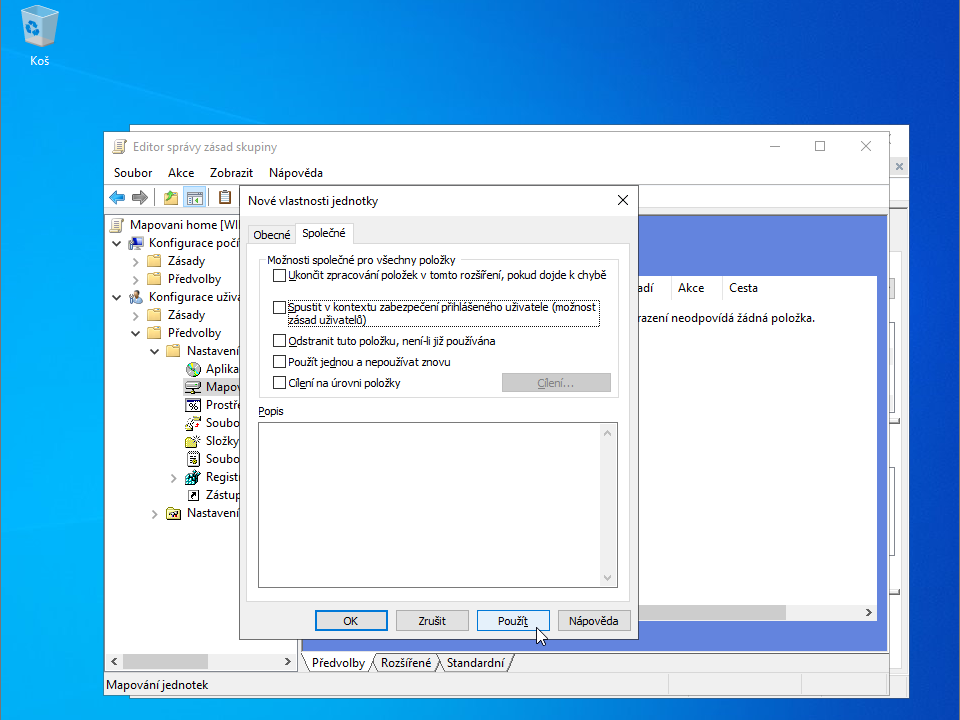
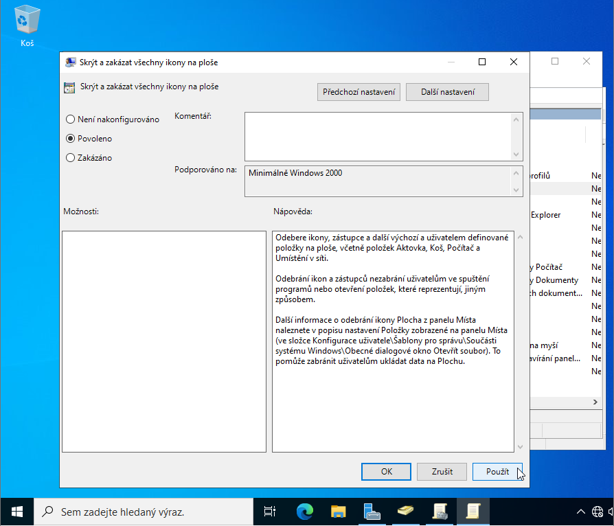
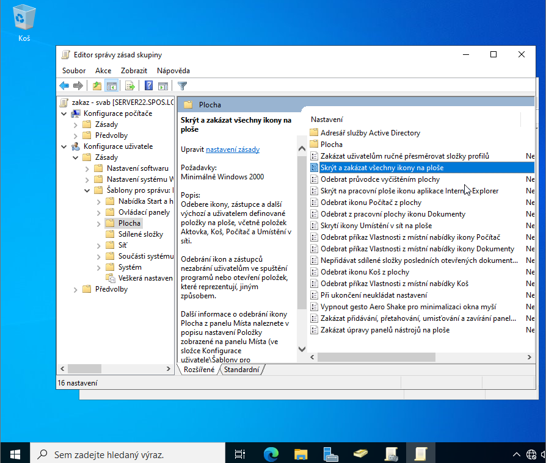
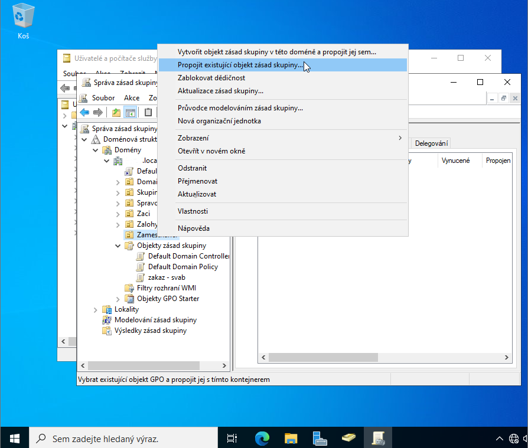

# Správa skupinových politik (Group Policy Objects - GPO)

Skupinové politiky představují klíčový nástroj pro centralizovanou správu konfigurací v doméně Active Directory. Tento dokument popisuje vytvoření objektů GPO, vynucení bezpečnostních restrikcí a automatizaci nastavení pracovního prostředí pro různé skupiny uživatelů.

## Podrobný postup konfigurace

### 1. Vytvoření nového objektu GPO
Otevřete konzoli **Group Policy Management** (`gpmc.msc`). Pravým tlačítkem klikněte na doménu nebo konkrétní organizační jednotku (OU) a zvolte možnost **Create a GPO in this domain, and Link it here...**. Zadejte srozumitelný název politiky (např. `Studenti_Restrikce_Desktopu`).

> [!TIP]
> Doporučuje se aplikovat GPO na organizační jednotky (OU) s uživateli nebo počítači, nikoliv na celou doménu. Tím minimalizujete riziko nechtěného omezení administrátorských účtů.

### 2. Struktura editoru skupinových politik
Klikněte pravým tlačítkem na vytvořený objekt GPO a zvolte **Edit**. Editor je rozdělen na dvě hlavní části:
- **Computer Configuration**: Nastavení aplikovaná na stroj při startu systému.
- **User Configuration**: Nastavení aplikovaná na konkrétního uživatele po přihlášení.



> [!NOTE]
> Pro většinu restrikcí uživatelského prostředí (plocha, menu Start, panely) se používá **User Configuration**.

### 3. Zamezení přístupu k Ovládacím panelům
V rámci editoru přejděte na:
`User Configuration → Administrative Templates → Control Panel`

Vyhledejte politiku **Prohibit access to Control Panel and PC settings** a nastavte ji na **Enabled**.


### 4. Vynucení pozadí plochy a zákaz změn
Pro zajištění jednotné firemní/školní identity přejděte na:
`User Configuration → Administrative Templates → Desktop`

Aktivujte politiku **Prohibit User from changing desktop background**. Tím znemožníte uživatelům měnit tapetu.



### 5. Další systémové restrikce
Podobným způsobem můžete omezit přístup k příkazové řádce, editoru registru nebo skrýt konkrétní ikony na ploše a v hlavním panelu.



> [!WARNING]
> Při nastavování restrikcí buďte opatrní, abyste nezablokovali kritické nástroje nezbytné pro běžnou práci uživatelů.

### 6. Automatické mapování síťových jednotek
Moderní způsob připojování disků je pomocí **Group Policy Preferences**:
`User Configuration → Preferences → Windows Settings → Drive Maps`

Zvolte **New → Mapped Drive**. Do pole "Location" zadejte cestu ve formátu UNC (např. `\\server\share\%username%`) a zvolte písmeno jednotky.


### 7. Filtrování zabezpečení (Security Filtering)
Na kartě **Scope** v konzoli GPO Management můžete definovat, na které skupiny nebo uživatele se má politika vztahovat. Ve výchozím nastavení je politika aplikována na všechny autorizované uživatele v dané OU.



### 8. Vynucení aktualizace na klientských stanicích
Změny v GPO se na klienty aplikují v pravidelných intervalech (standardně 90 minut + odchylka). Pro okamžitou aplikaci spusťte na klientské stanici příkaz:

```powershell
gpupdate /force
```

Pro ověření aktuálně aplikovaných politik použijte:
```powershell
gpresult /r
```

## Řešení potíží (Troubleshooting)

### Problém: Politika se na klientovi neprojevila
> [!IMPORTANT]
> Prověřte: 1) Zda je objekt GPO správně propojen (Linked) s příslušnou OU. 2) Zda se uživatel/počítač skutečně v této OU nachází. 3) Zda není nastaveno **Enforced** na nadřazeném objektu, který by vaši politiku přebíjel.

### Problém: Mapování disku nefunguje podle představ
> [!NOTE]
> V nastavení mapování disku v GPO zkuste změnit akci z **Update** na **Replace**. Také ověřte, zda má uživatel odpovídající oprávnění ke sdílené složce (viz dokumentace ke sdílení souborů).

---
[Zpět na přehled](../../README.md)


[<kbd> ⮞ Zpět na úvodní stránku </kbd>](../../README.md)
