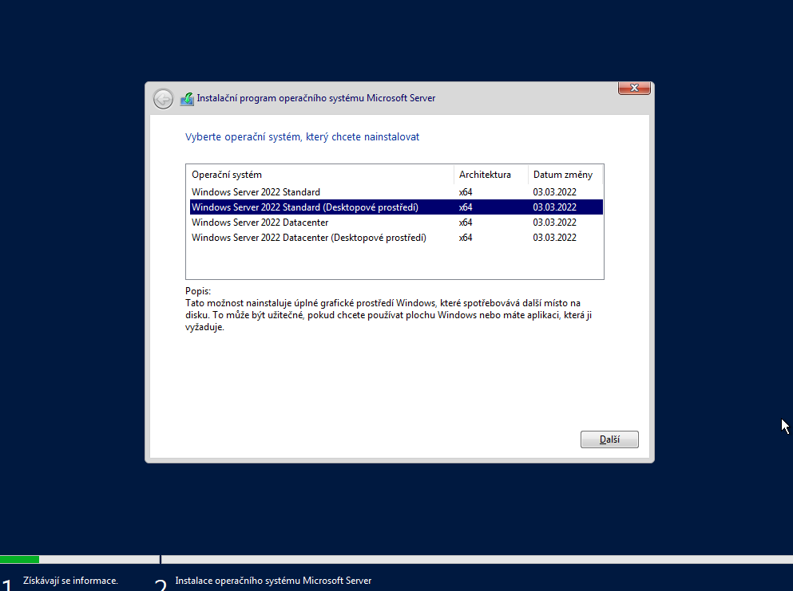
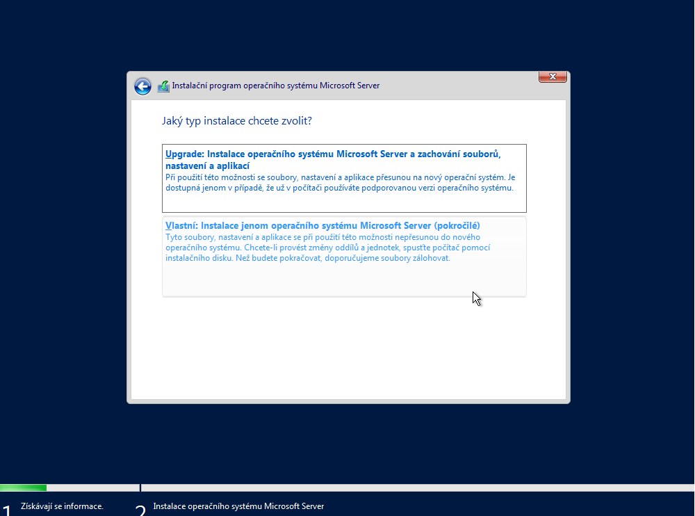
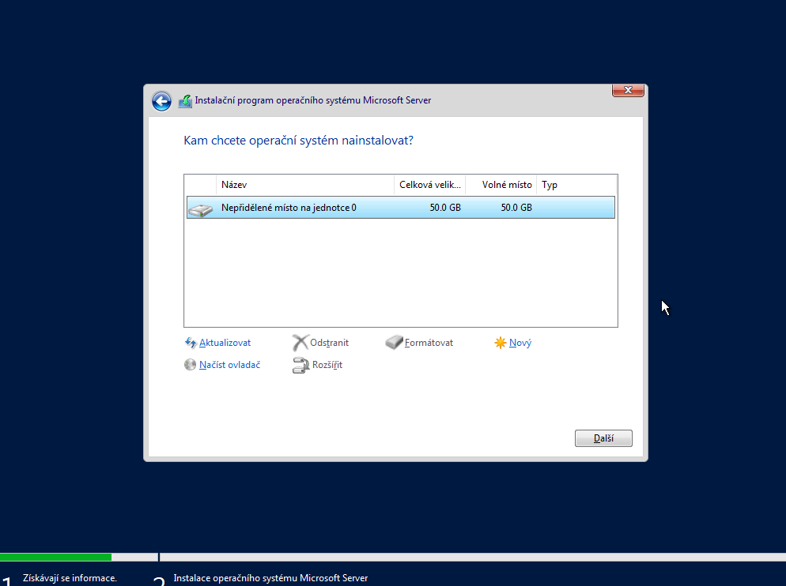
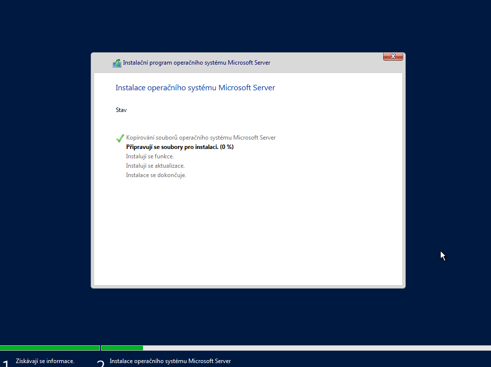
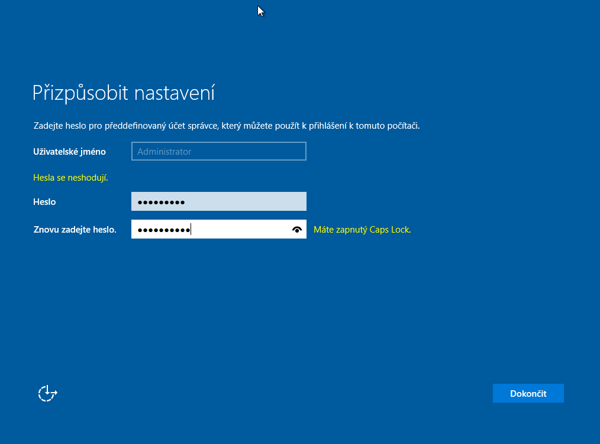
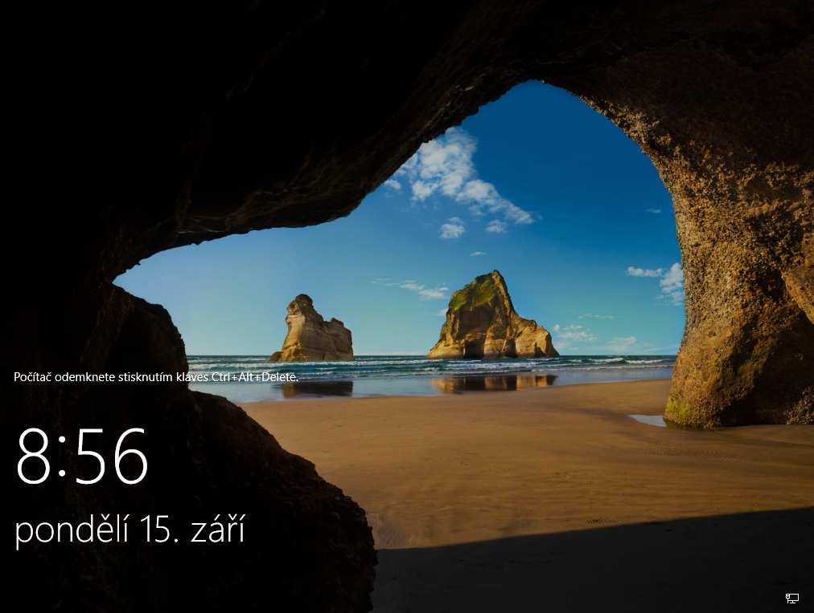

# Instalace operačního systému Windows Server

Tato příručka poskytuje podrobný postup instalace systému Windows Server (verze 2019 nebo 2022) s grafickým uživatelským rozhraním (Desktop Experience) v prostředí VirtualBox.

## Podrobný postup instalace

### 1. Spuštění instalace a inicializace
Po nabootování z ISO obrazu se spustí průvodce instalací. V úvodním okně zvolte jazyk instalace, formát času a měny a rozložení klávesnice. Potvrďte kliknutím na tlačítko "Install now".

### 2. Výběr edice operačního systému
V seznamu dostupných verzí vyberte "Windows Server Standard (Desktop Experience)". Tato volba je zásadní pro zajištění plného grafického rozhraní.

> [!WARNING]
> Verze bez označení "Desktop Experience" (označované jako Server Core) neobsahují grafické uživatelské rozhraní a ovládají se výhradně pomocí příkazové řádky a PowerShellu. Tato varianta není vhodná pro uživatele vyžadující GUI.

### 3. Typ instalace a správa disků
Zvolte možnost "Custom: Install Windows only (advanced)". V následujícím kroku vyberte cílový pevný disk (nepřidělené místo na disku) a pokračujte. Systém automaticky vytvoří potřebné oddíly.

### 4. Průběh kopírování souborů
Probíhá kopírování souborů, příprava instalace, instalace funkcí a aktualizací. Tento proces může trvat 10 až 20 minut v závislosti na výkonu hostitelského systému.

### 5. Konfigurace hesla administrátora
Po automatickém restartu systému je nutné nastavit heslo pro vestavěný účet Administrator. Heslo musí splňovat požadavky na složitost (velká a malá písmena, číslice a speciální znaky).

> [!NOTE]
> Pro testovací účely lze doporučit heslo ve formátu `Admin123!`, které splňuje všechny bezpečnostní politiky systému Windows Server.

### 6. Potvrzení a validace hesla
Zadejte heslo znovu pro potvrzení. Pokud heslo nesplňuje požadavky na složitost nebo se oba záznamy neshodují, systém vás nepustí k dalšímu kroku.

### 7. Dokončení instalace a první přihlášení
Po úspěšném nastavení hesla se zobrazí přihlašovací obrazovka. Po přihlášení se automaticky spustí Správce serveru (Server Manager). Systém je nyní připraven k další konfiguraci rolí a funkcí.

## Řešení potíží (Troubleshooting)

#### Virtuální stroj po restartu znovu bootuje do instalátoru.
> [!IMPORTANT]
> Po prvním restartu po dokončení fáze kopírování souborů je nutné odpojit ISO obraz z virtuální mechaniky. V nastavení VirtualBoxu (Settings → Storage) odstraňte disk z optické mechaniky, jinak může dojít k opakovanému spouštění instalace.

#### Heslo administrátora není přijato z důvodu nesplnění požadavků.
> [!TIP]
> Windows Server vyžaduje výchozí politiku hesel, která vynucuje minimálně 7 znaků a kombinaci alespoň tří ze čtyř kategorií znaků (velká písmena, malá písmena, číslice, symboly).

#### Po instalaci se zobrazí pouze černé okno s příkazovou řádkou.
> [!WARNING]
> Pravděpodobně jste vybrali verzi "Standard" nebo "Datacenter" bez přívlastku "Desktop Experience". V tomto případě je nutné provést reinstalaci se správným výběrem edice.

---

## Užitečné odkazy

### Oficiální dokumentace
- [Microsoft Docs: Windows Server](https://docs.microsoft.com/en-us/windows-server/) - Oficiální dokumentace
- [Windows Server Evaluation](https://www.microsoft.com/en-us/evalcenter/evaluate-windows-server-2022) - Stažení zkušební verze

### Návody a tutoriály
- [Instructables: Instalace Windows na VirtualBox](https://www.instructables.com/GuideHow-to-Install-Windows-10-on-Oracle-VM-Virtua/) - Podrobný průvodce
- [TechRepublic: Windows Server Installation](https://www.techrepublic.com/article/how-to-install-windows-server-2022/) - Profesionální návod

### Komunita a řešení problémů
- [Stack Overflow: Windows Server](https://stackoverflow.com/questions/tagged/windows-server) - Řešení technických problémů
- [Reddit r/WindowsServer](https://www.reddit.com/r/windowsserver/) - Diskuze administrátorů
- [Server Fault](https://serverfault.com/questions/tagged/windows-server) - Q&A pro systémové administrátory

---
[Zpět na přehled](../../README.md)
