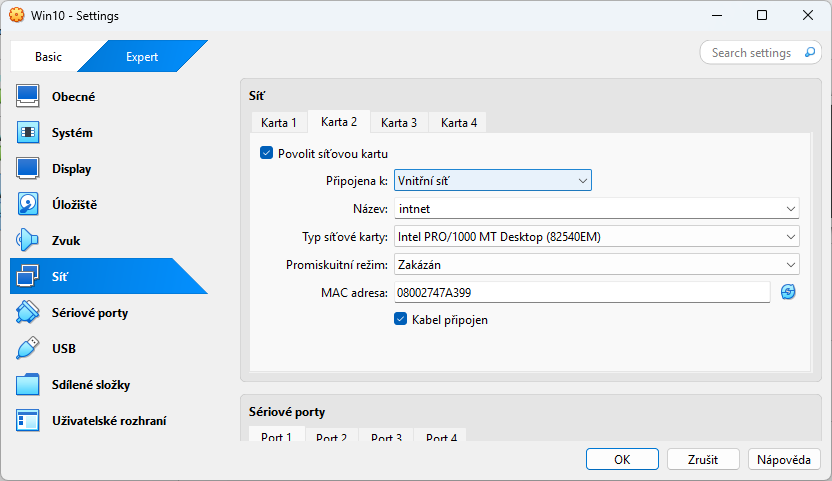

# Konfigurace virtuálního prostředí (VM Setup)

Tento dokument poskytuje podrobný technický návod pro vytvoření a konfiguraci virtuálních strojů v prostředí Oracle VM VirtualBox. Cílem je vytvořit stabilní testovací prostředí pro simulaci síťové infrastruktury s Windows Serverem a klientskými stanicemi.

## Podrobný postup konfigurace

### 1. Vytvoření a základní nastavení virtuálního stroje
Při vytváření nového virtuálního stroje (VM) dbejte na správnou alokaci prostředků, aby byla zajištěna plynulost běhu operačního systému.

1. V aplikaci VirtualBox klikněte na tlačítko **New**.
2. **Name and Operating System:**
   - **Name:** Např. `SVR-AD-01` (pro server) nebo `CLT-WIN10-01` (pro klienta).
   - **Type:** `Microsoft Windows`.
   - **Version:** `Windows 2019 (64-bit)` nebo `Windows 10 (64-bit)`.
3. **Memory Size:** Přidělte operační paměť.
   - Pro Windows Server doporučujeme minimálně **4096 MB (4 GB)**.
   - Pro Windows 10 doporučujeme minimálně **2048 MB (2 GB)**.
4. **Hard disk:** Zvolte "Create a virtual hard disk now" (formát VDI, dynamicky alokovaný).
   - Kapacita: minimálně **50 GB** pro server a **30 GB** pro klienta.

> [!NOTE]
> Dynamicky alokovaný disk zabírá na fyzickém disku hostitele pouze tolik místa, kolik je skutečně využito ve virtuálním stroji, až do nastavené maximální kapacity.

### 2. Konfigurace síťové infrastruktury
Pro simulaci reálného prostředí je nutné, aby server mohl komunikovat s internetem (pro stahování aktualizací) a zároveň s klientskými stanicemi v izolované vnitřní síti.

1. Otevřete **Settings** daného VM a přejděte do sekce **Network**.
2. **Adapter 1:** Ponechte nastaven na **NAT**. Tento adaptér zajišťuje překlad adres a přístup k internetu skrze hostitelský počítač.
3. **Adapter 2:** Zaškrtněte "Enable Network Adapter".
   - **Attached to:** Zvolte **Internal Network**.
   - **Name:** Ponechte výchozí `intnet` nebo zadejte vlastní název (všechny stroje v jedné labu musí mít tento název shodný).
   - **Promiscuous Mode:** V sekci Advanced nastavte na `Allow All` (pro pokročilé síťové operace).

> [!IMPORTANT]
> Pro správnou funkci doménových služeb (AD DS, DHCP, DNS) musí být vnitřní síť (Internal Network) striktně oddělena od ostatních sítí, aby nedocházelo ke kolizím s externími servery.

## Diagnostika a řešení potíží (Troubleshooting)

### Síťová konektivita
> [!WARNING]
> Pokud příkaz `ping` mezi stroji selhává, ověřte nejprve stav Windows Firewallu. Ve výchozím nastavení Windows blokuje ICMP Echo Request (ping). Pro testovací účely můžete firewall dočasně vypnout nebo vytvořit příchozí pravidlo pro ICMPv4.

### Výkon virtuálního stroje
> [!TIP]
> Pokud je systém pomalý, zkontrolujte v **Settings → System → Processor**, zda máte přiděleno alespoň **2 jádra CPU**. Také se ujistěte, že je v **Acceleration** povoleno **VT-x/AMD-V** a **Nested Paging**.

### Hardwarová virtualizace (BIOS/UEFI)
> [!IMPORTANT]
> Pokud VirtualBox hlásí chybu "VT-x is disabled in the BIOS", je nutné restartovat fyzický počítač, vstoupit do BIOS/UEFI a v nastavení procesoru povolit technologii **Intel Virtualization Technology** nebo **SVM Mode** (u AMD). Bez této volby nebude možné spouštět 64-bitové hostované systémy.

---
[Zpět na přehled](../../README.md)
