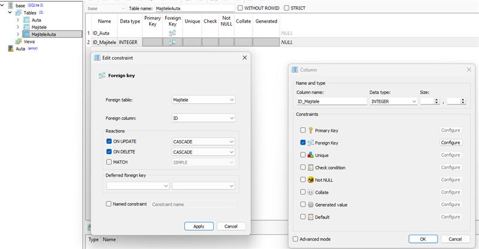

# Knihovní systém v C# s SQLite databází

>  **Tip pro Programování:** I když píšete cvičné projekty, zvykněte si názvy proměnných, tříd a metod psát v angličtině. Budete pak mít podstatně jednodušší orientaci v kódu, až budete řešit chyby přes zahraniční IT diskuze a návody.


Kompletní tutoriál pro vytvoření desktopové aplikace pro správu knihovny s využitím Windows Forms, SQLite databáze a MetroFramework UI.

## Obsah

1. [Přehled projektu](#přehled-projektu)
2. [Použité technologie](#použité-technologie)
3. [Architektura aplikace](#architektura-aplikace)
4. [Datový model](#datový-model)
5. [Implementace entit](#implementace-entit)
6. [Databázová vrstva](#databázová-vrstva)
7. [Uživatelské rozhraní](#uživatelské-rozhraní)
8. [Funkcionality aplikace](#funkcionality-aplikace)
9. [Rozšíření a vylepšení](#rozšíření-a-vylepšení)
10. [Užitečné odkazy](#užitečné-odkazy)

---

## Přehled projektu

Knihovní systém je desktopová aplikace umožňující:

- **Správu knih** - přidávání, editace, vyhledávání
- **Správu autorů** - evidence spisovatelů
- **Správu žánrů** - kategorizace knih
- **Správu zákazníků** - registrace čtenářů
- **Půjčování knih** - přiřazení knih zákazníkům
- **Vracení knih** - evidence navrácených výpůjček

### Hlavní funkce

| Funkce | Popis |
|--------|-------|
| Vytvoření databáze | Inicializace SQLite databáze s výchozími daty |
| Přidání entit | Formulář pro přidání knih, autorů, žánrů, zákazníků |
| Zobrazení tabulek | Prohlížení všech dat v DataGridView |
| Půjčky | Správa výpůjček a vracení knih |

---

## Použité technologie

### Vývojové prostředí
- **Visual Studio 2019/2022** - IDE pro vývoj
- **.NET Framework 4.7.2+** - runtime prostředí
- **Windows Forms** - UI framework

### Databáze
- **SQLite** - embedded databáze
- **System.Data.SQLite** - ADO.NET provider pro SQLite

### UI Framework
- **MetroFramework** - moderní vzhled oken

### NuGet balíčky

```xml
<packages>
  <package id="MetroModernUI" version="1.4.0" />
  <package id="System.Data.SQLite" version="1.0.118" />
  <package id="System.Data.SQLite.Core" version="1.0.118" />
</packages>
```

**Instalace přes Package Manager Console:**

```powershell
Install-Package System.Data.SQLite
Install-Package MetroModernUI
```

---

## Instalace a správa přes SQLiteStudio

Ještě předtím, než začneme psát C# kód, je dobré si databázi manuálně vytvořit, pochopit její strukturu a naplnit ji ukázkovými daty. K tomu nám výborně poslouží program SQLiteStudio.

### Kde stáhnout a jak spustit
Stáhněte si bezplatný nástroj ze stránky [https://sqlitestudio.pl/](https://sqlitestudio.pl/). Program se neinstaluje, stačí stáhnout ZIP archiv, rozbalit jej a spustit soubor `SQLiteStudio.exe`.

### Tvorba databáze a tabulek
1. V horním menu klikněte na **Database -> Add a database**.
2. Vyberte cestu, kam se má uložit nový soubor databáze (např. `knihovna.db`).
3. Dvojklikem na databázi ji připojte a vytvořte novou tabulku (ikona tabulky s hvězdičkou).
4. Vytvořte výše zmíněné tabulky (knihy, autori, zanr, zakaznici) a nastavte jejich primární klíče (PK - Primary Key) s automatickým navyšováním (Autoincrement).

### Propojování tabulek (Cizí klíče / Foreign Keys)
V relačních databázích musí být tabulky propojeny, abychom např. věděli, které auto patří jakému majiteli (nebo která kniha jakému autorovi). V SQLiteStudiu to uděláme pomocí "Foreign Keys" neboli Cizích klíčů.

> V ukázkovém projektu na webu máme příklad propojovací tabulky s auty (`MajiteleAuta`), ale proces je úplně stejný i pro knihy.

Když vytváříte sloupec (např. `AutorID` v tabulce `knihy`), dole v okně vlastností sloupce zaklikněte **Foreign Key**. Otevře se okno `Edit constraint`:
*   **Foreign Table:** Vyberte tabulku `autori` (nebo `Majitele` v případě aut).
*   **Foreign column:** Vyberte propojený sloupec `AutorID` (nebo `ID`).
*   **ON UPDATE:** Vyberte `CASCADE`.
*   **ON DELETE:** Vyberte `CASCADE`.
*   Klikněte na **Apply** a potvrďte SQL dotaz (zelená fajfka v hlavním okně).

*(Ověření: Pamatujte si postup podle tohoto obrázku)*


Po vytvoření struktury se přepněte do záložky **Data** (Data grid) a přidejte si pár pokusných záznamů, ať máte v aplikaci hned na začátku co číst.

---

## Architektura aplikace

```
knihovna/
├── Program.cs              # Vstupní bod aplikace
├── Form1.cs                # Hlavní okno
├── AddNewForm.cs           # Formulář pro přidání entit
├── ShowTableForm.cs        # Zobrazení tabulek
├── PujceniForm.cs          # Správa půjček
├── SQLClass.cs             # Databázová vrstva
├── Kniha.cs                # Model knihy
├── Autor.cs                # Model autora
├── Zakaznik.cs             # Model zákazníka
├── Zanr.cs                 # Model žánru
└── knihovna.db             # SQLite databáze
```

### Diagram architektury

```
┌─────────────────────────────────────────────────────────┐
│                    PREZENTAČNÍ VRSTVA                    │
│  ┌──────────┐  ┌──────────┐  ┌──────────┐  ┌──────────┐ │
│  │  Form1   │  │ AddNew   │  │ ShowTable│  │ Pujceni  │ │
│  │ (Hlavní) │  │  Form    │  │   Form   │  │  Form    │ │
│  └────┬─────┘  └────┬─────┘  └────┬─────┘  └────┬─────┘ │
└───────┼─────────────┼─────────────┼─────────────┼───────┘
        │             │             │             │
┌───────┴─────────────┴─────────────┴─────────────┴───────┐
│                    DATOVÁ VRSTVA                         │
│                      SQLClass                            │
│   ┌─────────┐ ┌─────────┐ ┌─────────┐ ┌─────────┐       │
│   │ Connect │ │ CRUD    │ │ Search  │ │ Create  │       │
│   │Disconnect│ │ operace │ │ Find    │ │ Tables  │       │
│   └─────────┘ └─────────┘ └─────────┘ └─────────┘       │
└─────────────────────────┬───────────────────────────────┘
                          │
┌─────────────────────────┴───────────────────────────────┐
│                    DATABÁZE (SQLite)                     │
│   ┌─────────┐ ┌─────────┐ ┌─────────┐ ┌─────────┐       │
│   │  knihy  │ │ autori  │ │  zanr   │ │zakaznici│       │
│   └─────────┘ └─────────┘ └─────────┘ └─────────┘       │
└─────────────────────────────────────────────────────────┘
```

---

## Datový model

### ER Diagram

```
┌───────────────┐       ┌───────────────┐
│    autori     │       │     zanr      │
├───────────────┤       ├───────────────┤
│ AutorID (PK)  │       │ ZanrID (PK)   │
│ jmeno         │       │ nazev         │
│ prijmeni      │       └───────┬───────┘
└───────┬───────┘               │
        │                       │
        │       ┌───────────────┴───────────────┐
        │       │            knihy              │
        │       ├───────────────────────────────┤
        └───────┤ KnihaID (PK)                  │
                │ nazev                         │
                │ AutorID (FK) ─────────────────┘
                │ ZanrID (FK)
                │ ZakaznikID (FK) ──────────────┐
                └───────────────────────────────┘
                                                │
                        ┌───────────────────────┴───┐
                        │        zakaznici          │
                        ├───────────────────────────┤
                        │ ZakaznikID (PK)           │
                        │ jmeno                     │
                        │ prijmeni                  │
                        └───────────────────────────┘
```

### SQL schéma

```sql
-- Tabulka knih
CREATE TABLE knihy (
    KnihaID INTEGER PRIMARY KEY AUTOINCREMENT,
    nazev VARCHAR(15),
    AutorID INTEGER,
    ZanrID INTEGER,
    ZakaznikID INTEGER  -- -1 = kniha není půjčena
);

-- Tabulka autorů
CREATE TABLE autori (
    AutorID INTEGER PRIMARY KEY AUTOINCREMENT,
    jmeno VARCHAR(15),
    prijmeni VARCHAR(15)
);

-- Tabulka žánrů
CREATE TABLE zanr (
    ZanrID INTEGER PRIMARY KEY AUTOINCREMENT,
    nazev VARCHAR(15)
);

-- Tabulka zákazníků
CREATE TABLE zakaznici (
    ZakaznikID INTEGER PRIMARY KEY AUTOINCREMENT,
    jmeno VARCHAR(15),
    prijmeni VARCHAR(15)
);
```

---

## Implementace entit

### Třída Kniha

Model reprezentující knihu v systému:

```csharp
using System;

namespace knihovna
{
    /// <summary>
    /// Reprezentuje knihu v knihovním systému
    /// </summary>
    internal class Kniha
    {
        /// <summary>
        /// Jedinečný identifikátor knihy
        /// </summary>
        public int KnihaID { get; set; }
        
        /// <summary>
        /// Název knihy
        /// </summary>
        public string nazev { get; set; }
        
        /// <summary>
        /// ID autora knihy (cizí klíč)
        /// </summary>
        public int AutorID { get; set; }
        
        /// <summary>
        /// ID žánru knihy (cizí klíč)
        /// </summary>
        public int ZanrID { get; set; }
        
        /// <summary>
        /// ID zákazníka, který má knihu půjčenou
        /// Hodnota -1 znamená, že kniha není půjčena
        /// </summary>
        public int ZakaznikID { get; set; }
        
        /// <summary>
        /// Konstruktor pro vytvoření instance knihy
        /// </summary>
        public Kniha(int KnihaID, string nazev, int AutorID, int ZanrID, int ZakaznikID)
        { 
            this.KnihaID = KnihaID;
            this.nazev = nazev;
            this.AutorID = AutorID;
            this.ZanrID = ZanrID;
            this.ZakaznikID = ZakaznikID; 
        }
    }
}
```

### Třída Autor

Model reprezentující autora:

```csharp
namespace knihovna
{
    /// <summary>
    /// Reprezentuje autora v knihovním systému
    /// </summary>
    internal class Autor
    {
        public int AutorID { get; set; }
        public string jmeno { get; set; }
        public string prijmeni { get; set; }
        
        public Autor(int AutorID, string jmeno, string prijmeni)
        {
            this.AutorID = AutorID;
            this.jmeno = jmeno;
            this.prijmeni = prijmeni;
        }
        
        /// <summary>
        /// Vrátí celé jméno autora
        /// </summary>
        public string CeleJmeno => $"{jmeno} {prijmeni}";
    }
}
```

### Třída Zakaznik

Model reprezentující zákazníka knihovny:

```csharp
namespace knihovna
{
    /// <summary>
    /// Reprezentuje zákazníka (čtenáře) knihovny
    /// </summary>
    internal class Zakaznik
    {
        public int ZakaznikID { get; set; }
        public string jmeno { get; set; }
        public string prijmeni { get; set; }
        
        public Zakaznik(int ZakaznikID, string jmeno, string prijmeni)
        {
            this.ZakaznikID = ZakaznikID;
            this.jmeno = jmeno;
            this.prijmeni = prijmeni;
        }
    }
}
```

### Třída Zanr

Model reprezentující žánr:

```csharp
namespace knihovna
{
    /// <summary>
    /// Reprezentuje literární žánr
    /// </summary>
    internal class Zanr
    {
        public int ZanrID { get; set; }
        public string nazev { get; set; }
        
        public Zanr(int ZanrID, string nazev)
        {
            this.ZanrID = ZanrID;
            this.nazev = nazev;
        }
    }
}
```

---

## Databázová vrstva

Třída `SQLClass` zajišťuje veškerou komunikaci s databází.

### Připojení k databázi

```csharp
using System.Data.SQLite;
using System.ComponentModel;

namespace knihovna
{
    internal class SQLClass
    {
        // Connection string pro SQLite
        public static string Cs { get; private set; }
        public static SQLiteConnection Connection { get; private set; }
        
        public SQLClass()
        {
            // Cesta k databázovému souboru (relativní)
            Cs = @"URI=file:../../../knihovna.db";
            Connection = new SQLiteConnection(Cs);
        }
        
        /// <summary>
        /// Otevře připojení k databázi
        /// </summary>
        public static void Connect()
        {
            try
            {
                Connection.Open();
            }
            catch (Exception ex) 
            { 
                MessageBox.Show(ex.Message); 
            }
        }
        
        /// <summary>
        /// Uzavře připojení k databázi
        /// </summary>
        public static void Disconnect()
        {
            try
            {
                Connection.Close();
            }
            catch (Exception ex) 
            { 
                MessageBox.Show(ex.Message); 
            }
        }
    }
}
```

### CRUD operace - CREATE

```csharp
/// <summary>
/// Přidá novou knihu do databáze
/// </summary>
/// <param name="nazev">Název knihy</param>
/// <param name="ZanrID">ID žánru</param>
/// <param name="AutorID">ID autora</param>
public static void NewKniha(string nazev, int ZanrID, int AutorID)
{
    try
    {
        Connect();
        SQLiteCommand prikaz = new SQLiteCommand(Connection);
        
        // Parametrizovaný dotaz chrání proti SQL injection
        prikaz.CommandText = @"
            INSERT INTO knihy(nazev, AutorID, ZanrID, ZakaznikID) 
            VALUES(@nazev, @AutorID, @ZanrID, -1);";
        
        prikaz.Parameters.AddWithValue("@AutorID", AutorID);
        prikaz.Parameters.AddWithValue("@nazev", nazev);
        prikaz.Parameters.AddWithValue("@ZanrID", ZanrID);
        
        prikaz.ExecuteNonQuery();
        Disconnect();
        
        MessageBox.Show("Kniha přidána");
    }
    catch (Exception ex) 
    { 
        MessageBox.Show(ex.Message); 
    }
}

/// <summary>
/// Přidá nového autora
/// </summary>
public static void NewAutor(string jmeno, string prijmeni)
{
    try
    {
        Connect();
        SQLiteCommand prikaz = new SQLiteCommand(Connection);
        
        prikaz.CommandText = @"
            INSERT INTO autori(jmeno, prijmeni) 
            VALUES(@jmeno, @prijmeni);";
        
        prikaz.Parameters.AddWithValue("@jmeno", jmeno);
        prikaz.Parameters.AddWithValue("@prijmeni", prijmeni);
        
        prikaz.ExecuteNonQuery();
        Disconnect();
        
        MessageBox.Show("Autor přidán!");
    }
    catch (Exception ex) 
    { 
        MessageBox.Show(ex.Message); 
    }
}

/// <summary>
/// Přidá nového zákazníka
/// </summary>
public static void NewZakaznik(string jmeno, string prijmeni)
{
    try
    {
        Connect();
        SQLiteCommand prikaz = new SQLiteCommand(Connection);
        
        prikaz.CommandText = @"
            INSERT INTO zakaznici(jmeno, prijmeni) 
            VALUES(@jmeno, @prijmeni);";
        
        prikaz.Parameters.AddWithValue("@jmeno", jmeno);
        prikaz.Parameters.AddWithValue("@prijmeni", prijmeni);
        
        prikaz.ExecuteNonQuery();
        Disconnect();
        
        MessageBox.Show("Zákazník přidán!");
    }
    catch (Exception ex) 
    { 
        MessageBox.Show(ex.Message); 
    }
}

/// <summary>
/// Přidá nový žánr
/// </summary>
public static void NewZanr(string nazev)
{
    try
    {
        Connect();
        SQLiteCommand prikaz = new SQLiteCommand(Connection);
        
        prikaz.CommandText = "INSERT INTO zanr(nazev) VALUES(@nazev);";
        prikaz.Parameters.AddWithValue("@nazev", nazev);
        
        prikaz.ExecuteNonQuery();
        Disconnect();
        
        MessageBox.Show("Žánr přidán!");
    }
    catch (Exception ex) 
    { 
        MessageBox.Show(ex.Message); 
    }
}
```

### CRUD operace - READ

```csharp
/// <summary>
/// Načte seznam všech zákazníků
/// </summary>
/// <returns>BindingList pro zobrazení v DataGridView</returns>
public static BindingList<Zakaznik> ListZakaznik()
{
    Connect();
    BindingList<Zakaznik> list = new BindingList<Zakaznik>();
    SQLiteCommand prikaz = new SQLiteCommand(Connection);
    
    prikaz.CommandText = "SELECT * FROM zakaznici";
    
    using (var reader = prikaz.ExecuteReader())
    {
        while (reader.Read())
        {
            list.Add(new Zakaznik(
                Convert.ToInt32(reader["ZakaznikID"]),
                (string)reader["jmeno"],
                (string)reader["prijmeni"]
            ));
        }
    }
    
    Disconnect();
    return list;
}

/// <summary>
/// Načte seznam všech autorů
/// </summary>
public static BindingList<Autor> ListAutor()
{
    Connect();
    BindingList<Autor> list = new BindingList<Autor>();
    SQLiteCommand prikaz = new SQLiteCommand(Connection);
    
    prikaz.CommandText = "SELECT * FROM autori";
    
    using (var reader = prikaz.ExecuteReader())
    {
        while (reader.Read())
        {
            list.Add(new Autor(
                Convert.ToInt32(reader["AutorID"]),
                (string)reader["jmeno"],
                (string)reader["prijmeni"]
            ));
        }
    }
    
    Disconnect();
    return list;
}

/// <summary>
/// Načte seznam všech žánrů
/// </summary>
public static BindingList<Zanr> ListZanr()
{
    Connect();
    BindingList<Zanr> list = new BindingList<Zanr>();
    SQLiteCommand prikaz = new SQLiteCommand(Connection);
    
    prikaz.CommandText = "SELECT * FROM zanr";
    
    using (var reader = prikaz.ExecuteReader())
    {
        while (reader.Read())
        {
            list.Add(new Zanr(
                Convert.ToInt32(reader["ZanrID"]),
                (string)reader["nazev"]
            ));
        }
    }
    
    Disconnect();
    return list;
}
```

### Vyhledávání knih

```csharp
/// <summary>
/// Vyhledá knihy podle zadaných kritérií
/// </summary>
/// <param name="KnihaID">ID knihy (-1 = ignorovat)</param>
/// <param name="nazev">Název knihy (prázdný = ignorovat)</param>
/// <param name="AutorID">ID autora (-1 = ignorovat)</param>
/// <param name="ZanrID">ID žánru (-1 = ignorovat)</param>
/// <param name="ZakaznikID">ID zákazníka (-1 = ignorovat)</param>
public static BindingList<Kniha> FindKniha(
    int KnihaID, 
    string nazev, 
    int AutorID, 
    int ZanrID, 
    int ZakaznikID)
{
    BindingList<Kniha> list = new BindingList<Kniha>();
    SQLiteCommand prikaz = new SQLiteCommand(Connection);
    Connect();
    
    // Dynamické sestavení WHERE klauzule
    string command = "";
    
    if (KnihaID != -1)
    {
        command += " KnihaID='" + KnihaID + "'";
    }
    
    if (nazev != "")
    {
        if (command.Length > 3) command += " AND ";
        command += " nazev='" + nazev + "'";
    }
    else
    {
        // Trik pro vypsání celé tabulky
        command += " nazev!='" + nazev + "'";
    }
    
    if (AutorID != -1)
    {
        if (command.Length > 3) command += " AND ";
        command += " AutorID='" + AutorID + "'";
    }
    
    if (ZanrID != -1)
    {
        if (command.Length > 3) command += " AND ";
        command += " ZanrID='" + ZanrID + "'";
    }
    
    if (ZakaznikID != -1)
    {
        if (command.Length > 3) command += " AND ";
        command += " ZakaznikID='" + ZakaznikID + "'";
    }
    
    try
    {
        prikaz.CommandText = "SELECT * FROM knihy WHERE " + command + ";";
        
        using (var reader = prikaz.ExecuteReader())
        {
            while (reader.Read())
            {
                list.Add(new Kniha(
                    Convert.ToInt32(reader["KnihaID"]),
                    (string)reader["nazev"],
                    Convert.ToInt32(reader["AutorID"]),
                    Convert.ToInt32(reader["ZanrID"]),
                    Convert.ToInt32(reader["ZakaznikID"])
                ));
            }
        }
        Disconnect();
    }
    catch 
    { 
        MessageBox.Show("Žádná kniha nebyla nalezena");
    }
    
    return list;
}
```

### CRUD operace - UPDATE

```csharp
/// <summary>
/// Upraví přiřazení knihy zákazníkovi (půjčení/vrácení)
/// </summary>
/// <param name="KnihaID">ID knihy</param>
/// <param name="ZakaznikID">ID zákazníka (-1 pro vrácení)</param>
public static void KnihaZakaznikEdit(int KnihaID, int ZakaznikID)
{
    try
    {
        Connect();
        SQLiteCommand prikaz = new SQLiteCommand(Connection);
        
        prikaz.CommandText = @"
            UPDATE knihy 
            SET ZakaznikID = " + ZakaznikID + @" 
            WHERE KnihaID = " + KnihaID + ";";
        
        prikaz.ExecuteNonQuery();
        Disconnect();
    }
    catch(Exception ex) 
    { 
        MessageBox.Show(ex.Message); 
    }
}

/// <summary>
/// Upraví údaje zákazníka
/// </summary>
public static void ZmenZakaznika(string jmeno, string prijmeni, int id)
{
    try
    {
        Connect();
        SQLiteCommand prikaz = new SQLiteCommand(Connection);
        
        prikaz.CommandText = @"
            UPDATE zakaznici 
            SET jmeno = @jmeno, prijmeni = @prijmeni 
            WHERE ZakaznikID = @ZakaznikID";
        
        prikaz.Parameters.AddWithValue("@jmeno", jmeno);
        prikaz.Parameters.AddWithValue("@prijmeni", prijmeni);
        prikaz.Parameters.AddWithValue("@ZakaznikID", id);
        
        prikaz.ExecuteNonQuery();
        Disconnect();
        
        MessageBox.Show("Uživatel upraven");
    }
    catch (Exception ex) 
    { 
        MessageBox.Show(ex.Message);
    }
}

/// <summary>
/// Upraví údaje knihy
/// </summary>
public static void ZmenKnihu(
    string nazev, 
    int AutorID, 
    int KnihaID, 
    int ZakaznikID, 
    int ZanrID)
{
    try
    {
        Connect();
        SQLiteCommand prikaz = new SQLiteCommand(Connection);
        
        prikaz.CommandText = @"
            UPDATE knihy 
            SET AutorID = @AutorID, 
                nazev = @nazev, 
                ZanrID = @ZanrID, 
                ZakaznikID = @ZakaznikID 
            WHERE KnihaID = @KnihaID";
        
        prikaz.Parameters.AddWithValue("@AutorID", AutorID);
        prikaz.Parameters.AddWithValue("@nazev", nazev);
        prikaz.Parameters.AddWithValue("@ZanrID", ZanrID);
        prikaz.Parameters.AddWithValue("@ZakaznikID", ZakaznikID);
        prikaz.Parameters.AddWithValue("@KnihaID", KnihaID);
        
        prikaz.ExecuteNonQuery();
        Disconnect();
        
        MessageBox.Show("Kniha upravena");
    }
    catch (Exception ex) 
    { 
        MessageBox.Show(ex.Message); 
    }
}
```

### Inicializace databáze

```csharp
/// <summary>
/// Vytvoří databázové tabulky a naplní je výchozími daty
/// </summary>
public static void VytvorDatabazi()
{
    try
    {
        Connect();
        SQLiteCommand prikaz = new SQLiteCommand(Connection);

        // Tabulka knih
        prikaz.CommandText = "DROP TABLE IF EXISTS knihy;";
        prikaz.ExecuteNonQuery();
        
        prikaz.CommandText = @"
            CREATE TABLE knihy(
                KnihaID INTEGER PRIMARY KEY AUTOINCREMENT, 
                nazev VARCHAR(15), 
                AutorID INTEGER, 
                ZanrID INTEGER, 
                ZakaznikID INTEGER
            );";
        prikaz.ExecuteNonQuery();
        
        // Výchozí knihy
        prikaz.CommandText = @"
            INSERT INTO knihy(nazev, AutorID, ZanrID, ZakaznikID) 
            VALUES('Zaklinac', 1, 1, 1);";
        prikaz.ExecuteNonQuery();
        
        prikaz.CommandText = @"
            INSERT INTO knihy(nazev, AutorID, ZanrID, ZakaznikID) 
            VALUES('Harry Potter a kamen mudrcu', 2, 1, 1);";
        prikaz.ExecuteNonQuery();
        
        prikaz.CommandText = @"
            INSERT INTO knihy(nazev, AutorID, ZanrID, ZakaznikID) 
            VALUES('1984', 3, 2, 2);";
        prikaz.ExecuteNonQuery();

        // Tabulka autorů
        prikaz.CommandText = "DROP TABLE IF EXISTS autori;";
        prikaz.ExecuteNonQuery();
        
        prikaz.CommandText = @"
            CREATE TABLE autori(
                AutorID INTEGER PRIMARY KEY AUTOINCREMENT, 
                jmeno VARCHAR(15), 
                prijmeni VARCHAR(15)
            );";
        prikaz.ExecuteNonQuery();
        
        // Výchozí autoři
        prikaz.CommandText = @"
            INSERT INTO autori(jmeno, prijmeni) 
            VALUES('Andrzej', 'Sapkowski');";
        prikaz.ExecuteNonQuery();
        
        prikaz.CommandText = @"
            INSERT INTO autori(jmeno, prijmeni) 
            VALUES('J. K.', 'Rowling');";
        prikaz.ExecuteNonQuery();
        
        prikaz.CommandText = @"
            INSERT INTO autori(jmeno, prijmeni) 
            VALUES('George', 'Orwell');";
        prikaz.ExecuteNonQuery();

        // Tabulka žánrů
        prikaz.CommandText = "DROP TABLE IF EXISTS zanr;";
        prikaz.ExecuteNonQuery();
        
        prikaz.CommandText = @"
            CREATE TABLE zanr(
                ZanrID INTEGER PRIMARY KEY AUTOINCREMENT, 
                nazev VARCHAR(15)
            );";
        prikaz.ExecuteNonQuery();
        
        prikaz.CommandText = "INSERT INTO zanr(nazev) VALUES('fantasy');";
        prikaz.ExecuteNonQuery();
        
        prikaz.CommandText = "INSERT INTO zanr(nazev) VALUES('roman');";
        prikaz.ExecuteNonQuery();

        // Tabulka zákazníků
        prikaz.CommandText = "DROP TABLE IF EXISTS zakaznici;";
        prikaz.ExecuteNonQuery();
        
        prikaz.CommandText = @"
            CREATE TABLE zakaznici(
                ZakaznikID INTEGER PRIMARY KEY AUTOINCREMENT, 
                jmeno VARCHAR(15), 
                prijmeni VARCHAR(15)
            );";
        prikaz.ExecuteNonQuery();
        
        // Výchozí zákazníci
        string[] zakaznici = {
            "('Jan', 'Novak')",
            "('Petr', 'Svoboda')",
            "('Martin', 'Dvorak')",
            "('Karel', 'Cerny')",
            "('Anna', 'Kralova')",
            "('Eva', 'Prochazkova')"
        };
        
        foreach (var z in zakaznici)
        {
            prikaz.CommandText = $"INSERT INTO zakaznici(jmeno, prijmeni) VALUES{z};";
            prikaz.ExecuteNonQuery();
        }

        Disconnect();
        MessageBox.Show("Databáze byla úspěšně vytvořena!");
    }
    catch (Exception ex) 
    { 
        MessageBox.Show(ex.Message); 
    }
}
```

---

## Uživatelské rozhraní

### Hlavní okno (Form1)

Hlavní okno používá MetroFramework pro moderní vzhled:

```csharp
using MetroFramework.Forms;

namespace knihovna
{
    public partial class Form1 : MetroForm
    { 
        public Form1()
        {
            InitializeComponent();
            
            // Inicializace databázového připojení
            SQLClass SQLClass = new SQLClass();
            this.Text = "Databáze";
        }
        
        // Vytvoření databáze
        private void button1_Click(object sender, EventArgs e)
        {
            SQLClass.VytvorDatabazi();
        }

        // Otevření formuláře pro půjčky
        private void button2_Click(object sender, EventArgs e)
        {
            PujceniForm pujceniForm = new PujceniForm();
            pujceniForm.Show();
        }

        // Otevření formuláře pro zobrazení tabulek
        private void button3_Click(object sender, EventArgs e)
        {
            ShowTableForm showTableForm = new ShowTableForm();
            showTableForm.Show();
        }

        // Otevření formuláře pro přidání nových entit
        private void button4_Click(object sender, EventArgs e)
        {
            AddNewForm addNewForm = new AddNewForm();
            addNewForm.Show();
        }
    }
}
```

### Formulář pro přidávání (AddNewForm)

```csharp
using MetroFramework.Forms;
using System.ComponentModel;

namespace knihovna
{
    public partial class AddNewForm : MetroForm
    {
        public AddNewForm()
        {
            InitializeComponent();
            LoadAuthors();  // Načtení autorů do ComboBoxu
            LoadGenres();   // Načtení žánrů do ComboBoxu
        }

        /// <summary>
        /// Načte autory do rozbalovacího seznamu
        /// </summary>
        private void LoadAuthors()
        {
            BindingList<Autor> autorList = SQLClass.ListAutor();
            foreach (Autor autor in autorList)
            {
                comboBox2.Items.Add(autor.jmeno + " " + autor.prijmeni);
            }
        }

        /// <summary>
        /// Načte žánry do rozbalovacího seznamu
        /// </summary>
        private void LoadGenres()
        {
            BindingList<Zanr> zanrList = SQLClass.ListZanr();
            foreach (Zanr zanr in zanrList)
            {
                comboBox1.Items.Add(zanr.nazev);
            }
        }

        // Přidání knihy
        private void button1_Click(object sender, EventArgs e)
        {
            SQLClass.NewKniha(
                textBox1.Text,                    // název
                comboBox1.SelectedIndex + 1,      // žánr ID
                comboBox2.SelectedIndex + 1       // autor ID
            );
        }

        // Přidání autora
        private void button2_Click(object sender, EventArgs e)
        {
            SQLClass.NewAutor(textBox2.Text, textBox3.Text);
        }

        // Přidání zákazníka
        private void button3_Click(object sender, EventArgs e)
        {
            SQLClass.NewZakaznik(textBox5.Text, textBox4.Text);
        }

        // Přidání žánru
        private void button4_Click(object sender, EventArgs e)
        {
            SQLClass.NewZanr(textBox7.Text);
        }
    }
}
```

### Formulář pro zobrazení tabulek (ShowTableForm)

```csharp
using MetroFramework.Forms;
using System.ComponentModel;

namespace knihovna
{
    public partial class ShowTableForm : MetroForm
    {
        public ShowTableForm()
        {
            InitializeComponent();
        }
        
        // Seznamy pro zobrazení v DataGridView
        BindingList<Kniha> knihaDisplayList = new BindingList<Kniha>();
        BindingList<Zakaznik> zakaznikDisplayList = new BindingList<Zakaznik>();
        BindingList<Autor> autorDisplayList = new BindingList<Autor>();
        BindingList<Zanr> zanrDisplayList = new BindingList<Zanr>();

        // Zobrazení zákazníků
        private void button1_Click(object sender, EventArgs e)
        {
            zakaznikDisplayList = SQLClass.ListZakaznik();
            dataGridView1.DataSource = new BindingSource().DataSource = zakaznikDisplayList;
            dataGridView1.Tag = "Zakaznik";  // Pro identifikaci při editaci
        }

        // Zobrazení knih
        private void button2_Click(object sender, EventArgs e)
        {
            knihaDisplayList = SQLClass.FindKniha(-1, "", -1, -1, -1);
            dataGridView1.DataSource = new BindingSource().DataSource = knihaDisplayList;
            dataGridView1.Tag = "Kniha";
        }

        // Zobrazení autorů
        private void button3_Click(object sender, EventArgs e)
        {
            autorDisplayList = SQLClass.ListAutor();
            dataGridView1.DataSource = new BindingSource().DataSource = autorDisplayList;
            dataGridView1.Tag = "Autor";
        }

        // Zobrazení žánrů
        private void button4_Click(object sender, EventArgs e)
        {
            zanrDisplayList = SQLClass.ListZanr();
            dataGridView1.DataSource = new BindingSource().DataSource = zanrDisplayList;
            dataGridView1.Tag = "Zanr";
        }

        /// <summary>
        /// Zpracování změny hodnoty v buňce - automatická aktualizace v DB
        /// </summary>
        private void dataGridView1_CellValueChanged(object sender, DataGridViewCellEventArgs e)
        {
            var row = dataGridView1.Rows[e.RowIndex];
            
            switch (dataGridView1.Tag.ToString())
            {
                case "Zakaznik":
                    SQLClass.ZmenZakaznika(
                        row.Cells[1].Value.ToString(),
                        row.Cells[2].Value.ToString(),
                        Convert.ToInt32(row.Cells[0].Value)
                    );
                    break;
                    
                case "Kniha":
                    SQLClass.ZmenKnihu(
                        row.Cells[1].Value.ToString(),
                        Convert.ToInt32(row.Cells[2].Value),
                        Convert.ToInt32(row.Cells[0].Value),
                        Convert.ToInt32(row.Cells[4].Value),
                        Convert.ToInt32(row.Cells[3].Value)
                    );
                    break;
                    
                case "Autor":
                    SQLClass.ZmenAutora(
                        row.Cells[1].Value.ToString(),
                        row.Cells[2].Value.ToString(),
                        Convert.ToInt32(row.Cells[0].Value)
                    );
                    break;
                    
                case "Zanr":
                    SQLClass.ZmenZanr(
                        row.Cells[1].Value.ToString(),
                        Convert.ToInt32(row.Cells[0].Value)
                    );
                    break;
            }
        }
    }
}
```

### Formulář pro půjčky (PujceniForm)

```csharp
using MetroFramework.Forms;
using System.ComponentModel;

namespace knihovna
{
    public partial class PujceniForm : MetroForm
    {
        public PujceniForm()
        {
            InitializeComponent();
        }
        
        // Seznam půjčených knih zákazníka
        BindingList<Kniha> pujceneKnihy = new BindingList<Kniha>();
        
        // Seznam nalezených knih k půjčení
        BindingList<Kniha> nalezeneKnihy = new BindingList<Kniha>();
        
        /// <summary>
        /// Vyhledání zákazníka podle jména, příjmení nebo ID
        /// </summary>
        private void button1_Click(object sender, EventArgs e)
        {
            try
            {
                string[] vysledek = SQLClass.FindZakaznik(
                    textBox4.Text,  // jméno
                    textBox3.Text,  // příjmení
                    textBox5.Text   // ID
                );
                
                button1.Text = "Uživatel nalezen!";
                
                // Zobrazení nalezených údajů
                textBox4.Text = vysledek[0];  // jméno
                textBox3.Text = vysledek[1];  // příjmení
                textBox5.Text = vysledek[2];  // ID
                
                // Načtení půjčených knih tohoto zákazníka
                pujceneKnihy = SQLClass.FindKniha(
                    -1, "", -1, -1, 
                    Convert.ToInt32(vysledek[2])
                );
                
                dataGridView2.DataSource = new BindingSource().DataSource = pujceneKnihy;
            }
            catch (Exception ex) 
            { 
                MessageBox.Show(ex.Message); 
            }
        }

        /// <summary>
        /// Vrácení vybrané knihy
        /// </summary>
        private void button2_Click(object sender, EventArgs e)
        {
            int rowIndex = dataGridView2.CurrentCell.RowIndex;
            
            // Nastavení ZakaznikID na -1 = kniha vrácena
            SQLClass.KnihaZakaznikEdit(pujceneKnihy[rowIndex].KnihaID, -1);
            
            MessageBox.Show("Kniha úspěšně navrácena!");
            
            // Odebrání ze seznamu
            pujceneKnihy.RemoveAt(rowIndex);
        }

        /// <summary>
        /// Vyhledání knihy k půjčení
        /// </summary>
        private void button3_Click(object sender, EventArgs e)
        {
            int AutorID = -1;
            int ZanrID = -1;
            
            // Hledání autora podle jména
            AutorID = SQLClass.FindAutorByName(textBox6.Text);
            
            // Hledání žánru podle názvu
            if (textBox7.Text.Length > 2)
            {
                ZanrID = SQLClass.FindZanrByName(textBox7.Text);
            }

            int KnihaID = -1;
            if (textBox1.Text.Length > 0)
            {
                KnihaID = Convert.ToInt32(textBox1.Text);
            }
            
            nalezeneKnihy = SQLClass.FindKniha(
                KnihaID,
                textBox2.Text,  // název
                AutorID,
                ZanrID,
                -1              // pouze nepůjčené
            );
            
            dataGridView1.DataSource = new BindingSource().DataSource = nalezeneKnihy;
        }

        /// <summary>
        /// Půjčení vybrané knihy vybranému zákazníkovi
        /// </summary>
        private void button4_Click(object sender, EventArgs e)
        {
            int rowIndex = dataGridView1.CurrentCell.RowIndex;
            int zakaznikID = Convert.ToInt32(textBox5.Text);
            
            SQLClass.KnihaZakaznikEdit(nalezeneKnihy[rowIndex].KnihaID, zakaznikID);
            
            MessageBox.Show("Kniha úspěšně půjčena!");
        }
    }
}
```

---

## Funkcionality aplikace

### Workflow půjčování knihy

```
1. Otevřít formulář "Půjčky"
              │
              ▼
2. Vyhledat zákazníka (jméno/příjmení/ID)
              │
              ▼
3. Zobrazí se půjčené knihy zákazníka
              │
              ▼
4. Vyhledat dostupnou knihu (název/autor/žánr)
              │
              ▼
5. Vybrat knihu v tabulce
              │
              ▼
6. Kliknout "Půjčit" → Kniha přiřazena zákazníkovi
```

### Workflow vracení knihy

```
1. Otevřít formulář "Půjčky"
              │
              ▼
2. Vyhledat zákazníka
              │
              ▼
3. V tabulce půjčených knih vybrat knihu
              │
              ▼
4. Kliknout "Navrátit" → ZakaznikID = -1
```

---

## Rozšíření a vylepšení

### Doporučená vylepšení

1. **Validace vstupů**
   - Kontrola prázdných polí
   - Kontrola duplicit
   - Formátování jmen (velké první písmeno)

2. **Bezpečnost**
   - Použití parametrizovaných dotazů všude (ochrana proti SQL injection)
   - Hashování hesel (pokud přidáte přihlašování)

3. **UX vylepšení**
   - Potvrzovací dialogy před smazáním
   - Automatické obnovení seznamů po změně
   - Filtrování a řazení v DataGridView

4. **Funkcionality**
   - Evidence data půjčení a vrácení
   - Upomínky na vrácení
   - Historie půjček
   - Export do CSV/PDF
   - Statistiky (nejpůjčovanější knihy, aktivní zákazníci)

### Příklad: Přidání data půjčení

```sql
-- Rozšířené schéma
ALTER TABLE knihy ADD COLUMN datum_pujceni DATE;
ALTER TABLE knihy ADD COLUMN datum_vraceni DATE;
```

```csharp
// Rozšířená třída Kniha
public class Kniha
{
    // ... existující vlastnosti ...
    public DateTime? DatumPujceni { get; set; }
    public DateTime? DatumVraceni { get; set; }
    
    public bool JePujcena => ZakaznikID != -1;
    public int DnyPujceno => DatumPujceni.HasValue 
        ? (DateTime.Now - DatumPujceni.Value).Days 
        : 0;
}
```

---

## Užitečné odkazy

### Dokumentace a tutoriály

- [Microsoft Docs - Windows Forms](https://docs.microsoft.com/cs-cz/dotnet/desktop/winforms/) - Oficiální dokumentace Windows Forms
- [SQLite Documentation](https://www.sqlite.org/docs.html) - Dokumentace SQLite databáze
- [System.Data.SQLite](https://system.data.sqlite.org/) - ADO.NET provider pro SQLite

### Komunita a podpora

- [Stack Overflow - C# SQLite](https://stackoverflow.com/questions/tagged/c%23+sqlite) - Otázky a odpovědi k SQLite v C#
- [Stack Overflow - Windows Forms](https://stackoverflow.com/questions/tagged/winforms) - Otázky k Windows Forms
- [Reddit r/csharp](https://www.reddit.com/r/csharp/) - Komunita C# vývojářů
- [Reddit r/learnprogramming](https://www.reddit.com/r/learnprogramming/) - Komunita pro učení programování

### Nástroje

- [DB Browser for SQLite](https://sqlitebrowser.org/) - GUI nástroj pro prohlížení SQLite databází
- [MetroFramework GitHub](https://github.com/thielj/MetroFramework) - Moderní UI framework pro WinForms
- [NuGet Gallery](https://www.nuget.org/) - Balíčky pro .NET projekty

### Další vzdělávání

- [C# Programming Guide](https://docs.microsoft.com/cs-cz/dotnet/csharp/programming-guide/) - Průvodce programováním v C#
- [ADO.NET Overview](https://docs.microsoft.com/cs-cz/dotnet/framework/data/adonet/) - Přístup k datům v .NET
- [Entity Framework Tutorial](https://www.entityframeworktutorial.net/) - Alternativa k přímému SQL (ORM)

---

## Shrnutí

Tento projekt demonstruje:

- **OOP principy** - Zapouzdření dat do tříd (Kniha, Autor, Zakaznik, Zanr)
- **Oddělení vrstev** - Prezentační vrstva (Forms) vs. datová vrstva (SQLClass)
- **CRUD operace** - Kompletní práce s databází (Create, Read, Update, Delete)
- **Windows Forms** - Tvorba desktopových aplikací s GUI
- **SQLite** - Embedded databáze nevyžadující server
- **Data binding** - Propojení dat s UI komponentami (BindingList, DataGridView)

Aplikace je připravena k rozšíření o další funkce jako historie půjček, statistiky nebo webové rozhraní.


[<kbd> ⮞ Zpět na úvodní stránku </kbd>](../README.md)
